# ORBITA Postgres ER Diagram

This diagram is generated from the SQLAlchemy models and schema initializer in this repo.

Schemas found:

- `core`: shared identity, organizations, users, brands, and projects
- `discover`: Discover Orbit research and SEO/GEO data
- `create_orbit`: Create Orbit briefs, articles, claims, and corpus documents
- `visibility`: Visibility Orbit AI probe prompts, runs, and alerts
- `knowledge`: Knowledge Core entities, facts, sources, and authors
- `optimize`: Optimize Orbit analysis runs
- `events`: initialized in Postgres, but no tables are currently defined in code

Relationship labels:

- `FK`: actual SQLAlchemy `ForeignKey`
- `ref`: logical UUID reference stored in Postgres without an actual FK constraint
- `legacy`: compatibility table retained by code comments for older routers

```mermaid
erDiagram
  CORE_ORGANIZATIONS {
    uuid id PK
    string name
    string slug UK
    timestamptz created_at
    timestamptz updated_at
  }

  CORE_USERS {
    uuid id PK
    string email UK
    string hashed_password
    string full_name
    boolean is_active
    boolean is_admin
    timestamptz created_at
    timestamptz updated_at
  }

  CORE_ORGANIZATION_MEMBERS {
    uuid id PK
    uuid organization_id FK
    uuid user_id FK
    string role
    timestamptz created_at
  }

  CORE_BRANDS {
    uuid id PK
    uuid organization_id FK
    string name
    string slug
    string industry
    text description
    string website_url
    string primary_domain
    string country
    uuid created_by_user_id FK
    timestamptz created_at
    timestamptz updated_at
  }

  CORE_PROJECTS {
    uuid id PK
    uuid organization_id FK
    uuid brand_id FK
    string name
    text description
    text target_audience
    string locale
    string status
    uuid created_by_user_id FK
    timestamptz created_at
    timestamptz updated_at
  }

  DISCOVER_WEBSITE_SCAN_RUNS {
    uuid id PK
    uuid organization_id
    uuid brand_id
    uuid project_id
    text website_url
    string status
    int pages_discovered
    int pages_scanned
    json seed_topics
    json errors
    timestamptz created_at
    timestamptz completed_at
  }

  DISCOVER_WEBSITE_PAGES {
    uuid id PK
    uuid organization_id
    uuid brand_id
    uuid project_id
    uuid scan_run_id
    text url
    string page_type
    text title
    text meta_description
    text h1
    json headings
    text body_excerpt
    int word_count
    boolean is_indexable
    string crawl_status
    timestamptz created_at
  }

  DISCOVER_KEYWORD_CLUSTERS {
    uuid id PK
    uuid organization_id
    uuid brand_id
    uuid project_id
    string seed_keyword
    int cluster_id
    string cluster_name
    string keyword
    int search_volume
    float difficulty
    string intent
    timestamptz created_at
  }

  DISCOVER_KEYWORD_OPPORTUNITIES {
    uuid id PK
    uuid organization_id
    uuid brand_id
    uuid project_id
    uuid source_run_id
    text source_page_url
    string seed_topic
    string keyword
    string normalized_keyword
    string intent
    float intent_score
    int search_volume
    float difficulty
    float relevance_score
    string cluster_name
    boolean selected
    text selection_notes
    timestamptz created_at
  }

  DISCOVER_SERP_RESULTS {
    uuid id PK
    uuid organization_id
    uuid brand_id
    uuid project_id
    string query
    int position
    text title
    text url
    string domain
    text snippet
    json headings
    json entities
    int word_count
    float readability
    timestamptz created_at
  }

  DISCOVER_COMPETITOR_DOMAINS {
    uuid id PK
    uuid organization_id
    uuid brand_id
    uuid project_id
    string domain
    float avg_position
    int ranking_keyword_count
    float visibility_score
    json top_keywords
    timestamptz created_at
  }

  DISCOVER_COMPETITOR_PAGES {
    uuid id PK
    uuid organization_id
    uuid brand_id
    uuid project_id
    uuid competitor_domain_id
    uuid keyword_id
    string keyword
    text url
    text title
    int position
    json headings
    json entities
    int word_count
    float readability
    timestamptz created_at
  }

  DISCOVER_AI_SCAN_RESULTS {
    uuid id PK
    uuid organization_id
    uuid brand_id
    uuid project_id
    string query
    string engine
    text answer_text
    json cited_urls
    json cited_domains
    int answer_length
    timestamptz created_at
  }

  DISCOVER_QUESTIONS {
    uuid id PK
    uuid organization_id
    uuid brand_id
    uuid project_id
    string topic
    text question_text
    string source
    string q_type
    timestamptz created_at
  }

  DISCOVER_CONTENT_DRAFTS {
    uuid id PK
    uuid organization_id
    uuid brand_id
    uuid project_id
    uuid keyword_id
    text title
    string slug
    string content_type
    string intent
    string status
    text meta_title
    text meta_description
    json outline
    text body_markdown
    json faq
    timestamptz created_at
    timestamptz updated_at
  }

  DISCOVER_PROJECTS_LEGACY {
    uuid id PK
    string name
    text description
  }

  DISCOVER_COMPANY_PROFILES_LEGACY {
    uuid id PK
    uuid project_id
    string company_name
    string website_url
    string primary_domain
    string industry
    text target_audience
    string country
    string onboarding_status
  }

  CREATE_TONE_PROFILES {
    string id PK
    string organization_id
    string brand_id
    string user_id
    string name
    enum style
    text system_prompt
    json few_shot_examples
    boolean is_default
    timestamptz created_at
  }

  CREATE_BRIEFS {
    string id PK
    string organization_id
    string brand_id
    string project_id
    string user_id
    string topic
    string h1
    json h2s
    json h3s
    json keywords
    json questions
    json entities
    string target_audience
    enum tone_style
    enum status
    string source_keyword_opportunity_id
    string source_serp_query
    json research_context
    timestamptz created_at
    timestamptz updated_at
  }

  CREATE_ARTICLES {
    string id PK
    string brief_id
    string organization_id
    string brand_id
    string project_id
    string user_id
    string title
    text body
    int word_count
    enum tone_style
    float entity_score
    string factguard_status
    enum status
    string latest_optimization_run_id
    int latest_optimization_score
    timestamptz created_at
    timestamptz updated_at
  }

  CREATE_CLAIMS {
    string id PK
    string article_id
    text text
    enum status
    float confidence
    text source_context
    text reasoning
    string knowledge_core_fact_id
    timestamptz created_at
  }

  CREATE_CORPUS_DOCUMENTS {
    string id PK
    string organization_id
    string brand_id
    string user_id
    string title
    string source_type
    text content
    string source_url
    int chunk_count
    enum status
    text error_message
    timestamptz indexed_at
    timestamptz created_at
  }

  CREATE_USERS_LEGACY {
    string id PK
    string email UK
    string hashed_password
    string organization_id
    string full_name
    boolean is_active
  }

  VISIBILITY_PROBE_PROMPTS {
    uuid id PK
    uuid organization_id
    uuid brand_id
    uuid project_id
    text prompt_text
    string category
    boolean is_active
    timestamptz created_at
  }

  VISIBILITY_PROBE_RUNS {
    uuid id PK
    uuid organization_id
    uuid brand_id
    uuid project_id
    uuid prompt_id
    enum llm_engine
    enum status
    text prompt_text
    text raw_response
    jsonb parsed_result
    text error_message
    timestamptz created_at
    timestamptz completed_at
  }

  VISIBILITY_ALERTS {
    uuid id PK
    uuid organization_id
    uuid brand_id
    uuid project_id
    uuid probe_run_id
    enum alert_type
    enum severity
    string title
    text description
    jsonb details
    boolean resolved
    timestamptz created_at
  }

  VISIBILITY_USERS_LEGACY {
    uuid id PK
    string email UK
  }

  VISIBILITY_BRANDS_LEGACY {
    uuid id PK
    string name
    string slug
  }

  VISIBILITY_FACTS_LEGACY {
    uuid id PK
    string attribute
    text value
  }

  KNOWLEDGE_ENTITIES {
    uuid id PK
    uuid organization_id
    uuid brand_id
    string name
    string type
    string category
    text description
    timestamptz created_at
    timestamptz updated_at
  }

  KNOWLEDGE_FACTS {
    uuid id PK
    uuid entity_id FK
    uuid organization_id
    uuid brand_id
    string attribute
    text value
    string unit
    float confidence
    boolean is_verified
    string verified_by
    text source_url
    timestamptz created_at
    timestamptz updated_at
  }

  KNOWLEDGE_SOURCES {
    uuid id PK
    uuid organization_id
    uuid brand_id
    text url
    string title
    string domain
    string source_type
    int reliability_score
    boolean is_active
    timestamptz fetched_at
    timestamptz created_at
  }

  KNOWLEDGE_AUTHOR_PROFILES {
    uuid id PK
    uuid organization_id
    uuid brand_id
    string name
    text bio
    text credentials
    string linkedin_url
    jsonb expertise_areas
    jsonb eeeat_signals
    jsonb schema_markup
    timestamptz created_at
    timestamptz updated_at
  }

  OPTIMIZE_OPTIMIZATION_RUNS {
    uuid id PK
    uuid organization_id
    uuid brand_id
    uuid project_id
    uuid article_id
    string source_type
    text source_url
    string target_keyword
    string content_type
    string author_name
    int overall_score
    int seo_score
    int geo_score
    int eeat_score
    int schema_score
    jsonb issues
    jsonb schema_json
    string schema_type
    jsonb details
    string status
    uuid created_by_user_id
    timestamptz created_at
  }

  CORE_ORGANIZATIONS ||--o{ CORE_ORGANIZATION_MEMBERS : FK_has
  CORE_USERS ||--o{ CORE_ORGANIZATION_MEMBERS : FK_belongs_to
  CORE_ORGANIZATIONS ||--o{ CORE_BRANDS : FK_owns
  CORE_ORGANIZATIONS ||--o{ CORE_PROJECTS : FK_owns
  CORE_BRANDS ||--o{ CORE_PROJECTS : FK_has
  CORE_USERS ||--o{ CORE_BRANDS : FK_created_by
  CORE_USERS ||--o{ CORE_PROJECTS : FK_created_by

  CORE_ORGANIZATIONS ||--o{ DISCOVER_WEBSITE_SCAN_RUNS : ref_scopes
  CORE_BRANDS ||--o{ DISCOVER_WEBSITE_SCAN_RUNS : ref_scopes
  CORE_PROJECTS ||--o{ DISCOVER_WEBSITE_SCAN_RUNS : ref_scopes
  DISCOVER_WEBSITE_SCAN_RUNS ||--o{ DISCOVER_WEBSITE_PAGES : ref_scanned
  DISCOVER_WEBSITE_SCAN_RUNS ||--o{ DISCOVER_KEYWORD_OPPORTUNITIES : ref_source_run
  CORE_PROJECTS ||--o{ DISCOVER_KEYWORD_CLUSTERS : ref_scopes
  CORE_PROJECTS ||--o{ DISCOVER_KEYWORD_OPPORTUNITIES : ref_scopes
  CORE_PROJECTS ||--o{ DISCOVER_SERP_RESULTS : ref_scopes
  CORE_PROJECTS ||--o{ DISCOVER_COMPETITOR_DOMAINS : ref_scopes
  DISCOVER_COMPETITOR_DOMAINS ||--o{ DISCOVER_COMPETITOR_PAGES : ref_has
  DISCOVER_KEYWORD_OPPORTUNITIES ||--o{ DISCOVER_COMPETITOR_PAGES : ref_keyword
  CORE_PROJECTS ||--o{ DISCOVER_AI_SCAN_RESULTS : ref_scopes
  CORE_PROJECTS ||--o{ DISCOVER_QUESTIONS : ref_scopes
  CORE_PROJECTS ||--o{ DISCOVER_CONTENT_DRAFTS : ref_scopes
  DISCOVER_KEYWORD_OPPORTUNITIES ||--o{ DISCOVER_CONTENT_DRAFTS : ref_keyword
  DISCOVER_PROJECTS_LEGACY ||--o{ DISCOVER_COMPANY_PROFILES_LEGACY : legacy_project

  CORE_ORGANIZATIONS ||--o{ CREATE_TONE_PROFILES : ref_scopes
  CORE_BRANDS ||--o{ CREATE_TONE_PROFILES : ref_scopes
  CORE_USERS ||--o{ CREATE_TONE_PROFILES : ref_owns
  CORE_PROJECTS ||--o{ CREATE_BRIEFS : ref_scopes
  CORE_USERS ||--o{ CREATE_BRIEFS : ref_owns
  DISCOVER_KEYWORD_OPPORTUNITIES ||--o{ CREATE_BRIEFS : ref_handoff
  CREATE_BRIEFS ||--o{ CREATE_ARTICLES : ref_has
  CORE_USERS ||--o{ CREATE_ARTICLES : ref_owns
  CREATE_ARTICLES ||--o{ CREATE_CLAIMS : ref_has
  KNOWLEDGE_FACTS ||--o{ CREATE_CLAIMS : ref_verifies
  CORE_USERS ||--o{ CREATE_CORPUS_DOCUMENTS : ref_owns

  CORE_ORGANIZATIONS ||--o{ VISIBILITY_PROBE_PROMPTS : ref_scopes
  CORE_BRANDS ||--o{ VISIBILITY_PROBE_PROMPTS : ref_scopes
  CORE_PROJECTS ||--o{ VISIBILITY_PROBE_PROMPTS : ref_scopes
  VISIBILITY_PROBE_PROMPTS ||--o{ VISIBILITY_PROBE_RUNS : ref_runs
  VISIBILITY_PROBE_RUNS ||--o{ VISIBILITY_ALERTS : ref_raises

  CORE_ORGANIZATIONS ||--o{ KNOWLEDGE_ENTITIES : ref_scopes
  CORE_BRANDS ||--o{ KNOWLEDGE_ENTITIES : ref_scopes
  KNOWLEDGE_ENTITIES ||--o{ KNOWLEDGE_FACTS : FK_has
  CORE_BRANDS ||--o{ KNOWLEDGE_SOURCES : ref_scopes
  CORE_BRANDS ||--o{ KNOWLEDGE_AUTHOR_PROFILES : ref_scopes

  CORE_ORGANIZATIONS ||--o{ OPTIMIZE_OPTIMIZATION_RUNS : ref_scopes
  CORE_BRANDS ||--o{ OPTIMIZE_OPTIMIZATION_RUNS : ref_scopes
  CORE_PROJECTS ||--o{ OPTIMIZE_OPTIMIZATION_RUNS : ref_scopes
  CREATE_ARTICLES ||--o{ OPTIMIZE_OPTIMIZATION_RUNS : ref_analyzes
  CORE_USERS ||--o{ OPTIMIZE_OPTIMIZATION_RUNS : ref_created_by
  OPTIMIZE_OPTIMIZATION_RUNS ||--o{ CREATE_ARTICLES : ref_latest_run
```

## Source Files

- `auth-service/backend/app/models.py`
- `mvp-mac/backend/app/models.py`
- `Create/create-orbit-mvp/backend/app/models.py`
- `Visibility-orbit/visibility-orbit/backend/app/models/__init__.py`
- `knowledge-core/api/app/models/*.py`
- `Optimize-Orbit/optimize-orbit/backend/app/models.py`
- `init-schemas.sql`

## Notes

- The shared Postgres database is initialized with an `events` schema, but no SQLAlchemy models currently create tables there.
- Many cross-service fields are UUID/string references by convention rather than enforced database foreign keys. The services rely on request context and APIs for these joins.
- `discover.projects`, `discover.company_profiles`, `create_orbit.users`, `visibility.users`, `visibility.brands`, and `visibility.facts` are marked as legacy compatibility tables because the model comments say ownership moved to `core` or `knowledge`, but the classes still exist and can create tables.
