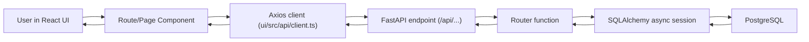
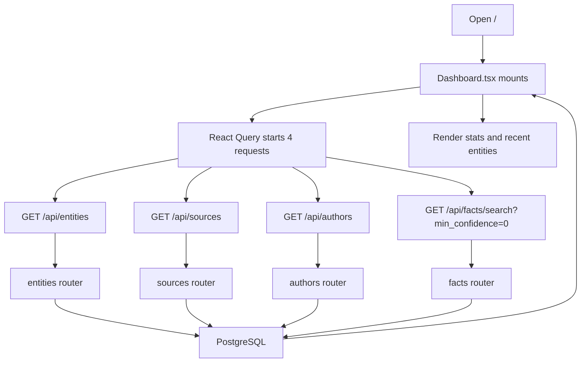
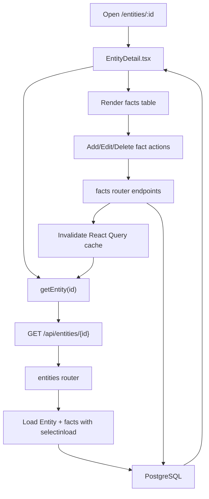
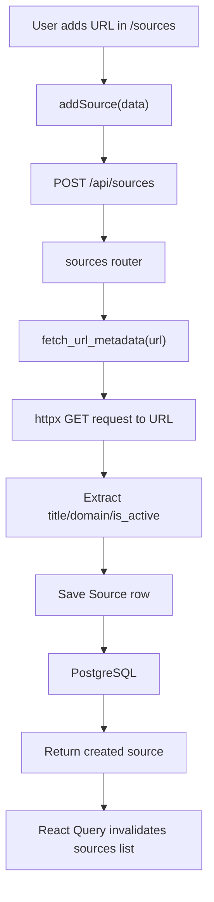
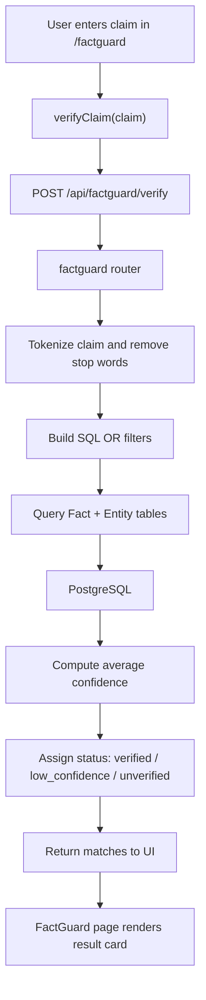
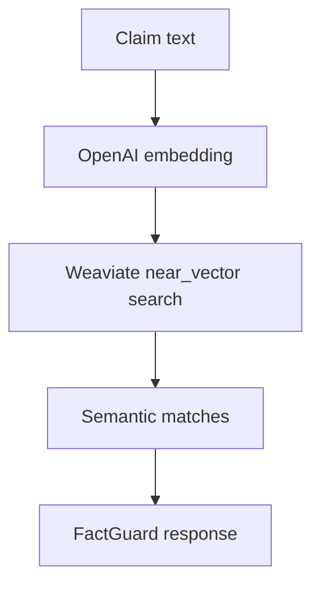

# ORBITA Knowledge Core Project Guide

## 1. What This Project Is

ORBITA Knowledge Core is a small full-stack application for managing a brand's "source of truth".

It stores:

- entities such as products, people, awards, stats, and policies
- facts attached to those entities
- citation sources that support those facts
- author profiles used for trust and E-E-A-T style metadata
- a FactGuard workflow that checks a written claim against stored facts

At a high level, this is a **brand knowledge base + citation registry + claim verification tool**.

## 2. What Problem It Solves

Teams using AI for content often run into the same problems:

- facts are spread across docs, sheets, and people's memory
- writers cannot easily tell which claims are approved
- citations are inconsistent or missing
- author credibility data is not centralized
- AI-generated claims can drift away from approved truth

This project solves that by giving one place to:

1. define brand entities
2. attach structured facts to them
3. attach sources to support those facts
4. store author credibility profiles
5. check a claim against stored facts before publishing

## 3. Core Purpose

The app is designed as an internal "brand brain".

The intended workflow is:

1. add entities like products, founders, policies, or awards
2. add facts under each entity
3. add citation URLs that represent approved references
4. add author profiles with credentials and expertise
5. use FactGuard to verify new claims against stored data

## 4. Tech Stack

### Backend

- FastAPI
- SQLAlchemy async ORM
- PostgreSQL
- optional Weaviate integration for semantic fact search
- Redis provisioned in Docker, but not currently used by app code

### Frontend

- React 18
- Vite
- TypeScript
- React Router
- TanStack Query
- Axios
- Tailwind CSS

### Infra

- Docker Compose for PostgreSQL, Weaviate, and Redis

## 5. Current Folder Structure

```text
knowledge-core/
├── .env.example
├── docker-compose.yml
├── api/
│   ├── requirements.txt
│   ├── venv/
│   └── app/
│       ├── __init__.py
│       ├── config.py
│       ├── database.py
│       ├── main.py
│       ├── models/
│       │   ├── __init__.py
│       │   ├── author.py
│       │   ├── entity.py
│       │   ├── fact.py
│       │   └── source.py
│       ├── routers/
│       │   ├── __init__.py
│       │   ├── authors.py
│       │   ├── entities.py
│       │   ├── factguard.py
│       │   ├── facts.py
│       │   └── sources.py
│       └── services/
│           └── embedding.py
├── ui/
│   ├── index.html
│   ├── package.json
│   ├── postcss.config.js
│   ├── tailwind.config.js
│   ├── tsconfig.json
│   ├── vite.config.ts
│   └── src/
│       ├── App.tsx
│       ├── index.css
│       ├── main.tsx
│       ├── api/
│       │   └── client.ts
│       ├── components/
│       │   └── index.tsx
│       └── pages/
│           ├── Authors.tsx
│           ├── Dashboard.tsx
│           ├── Entities.tsx
│           ├── EntityDetail.tsx
│           ├── FactGuard.tsx
│           └── Sources.tsx
└── docs/
    └── PROJECT_GUIDE.md
```

## 6. Backend Architecture

### Entry Point

File: `api/app/main.py`

Responsibilities:

- creates the FastAPI app
- registers CORS
- auto-creates database tables on startup
- mounts all routers under `/api`
- exposes `/health`

Important note:

- it uses `Base.metadata.create_all()` on startup instead of migrations
- this is acceptable for an MVP/demo, but not ideal for production

### Configuration

File: `api/app/config.py`

Responsibilities:

- reads settings from environment variables or `.env`
- defines database, Weaviate, Redis, OpenAI, and secret config

Important note:

- the default `DATABASE_URL` points to `knowledge_core`
- `docker-compose.yml` uses `Orbita_PGDB`
- the project depends on `.env` to align those values

### Database Layer

File: `api/app/database.py`

Responsibilities:

- creates the async SQLAlchemy engine
- provides `AsyncSessionLocal`
- exposes `get_db()` dependency for route handlers

### Models

#### `api/app/models/entity.py`

Represents a domain object such as:

- product
- person
- award
- stat
- policy

Fields:

- `id`
- `brand_id`
- `name`
- `type`
- `category`
- `description`
- timestamps

#### `api/app/models/fact.py`

Represents a fact attached to an entity.

Fields:

- `entity_id`
- `brand_id`
- `attribute`
- `value`
- `unit`
- `confidence`
- `is_verified`
- `verified_by`
- `source_url`
- timestamps

#### `api/app/models/source.py`

Represents a citation source.

Fields:

- `brand_id`
- `url`
- `title`
- `domain`
- `source_type`
- `reliability_score`
- `is_active`
- `fetched_at`
- `created_at`

#### `api/app/models/author.py`

Represents an author profile for credibility and metadata.

Fields:

- `brand_id`
- `name`
- `bio`
- `credentials`
- `linkedin_url`
- `expertise_areas`
- `eeeat_signals`
- `schema_markup`
- timestamps

### Service Layer

#### `api/app/services/embedding.py`

Purpose:

- contains the future semantic-search implementation
- integrates OpenAI embeddings with Weaviate
- can create Weaviate collections
- can upsert facts into vector storage
- can search facts semantically

Current state:

- this is **not wired into app startup**
- current FactGuard still uses PostgreSQL keyword matching
- this file is a future upgrade path, not active MVP behavior

### Routers

#### Entities Router

File: `api/app/routers/entities.py`

Endpoints:

- `GET /api/entities`
  Purpose: list entities for a brand, with optional search and type filter
- `POST /api/entities`
  Purpose: create an entity
- `GET /api/entities/{entity_id}`
  Purpose: fetch one entity with all attached facts
- `PUT /api/entities/{entity_id}`
  Purpose: update name, type, category, or description
- `DELETE /api/entities/{entity_id}`
  Purpose: remove an entity and its facts

Behavior note:

- list endpoint calculates `fact_count` with an extra query per entity
- that is fine for small data, but inefficient at scale

#### Facts Router

File: `api/app/routers/facts.py`

Endpoints:

- `GET /api/facts/search`
  Purpose: search facts by brand, optional entity name, attribute, and confidence threshold
- `POST /api/facts/entity/{entity_id}`
  Purpose: add a fact under an entity
- `PUT /api/facts/{fact_id}`
  Purpose: update a fact
- `DELETE /api/facts/{fact_id}`
  Purpose: delete a fact

This is the main structured knowledge layer.

#### Sources Router

File: `api/app/routers/sources.py`

Endpoints:

- `GET /api/sources`
  Purpose: list sources for a brand
- `POST /api/sources`
  Purpose: create a source, auto-fetch title/domain, and detect whether the URL is alive
- `DELETE /api/sources/{source_id}`
  Purpose: delete a source

Behavior note:

- on creation, the backend calls the URL with `httpx` and tries to extract the page title
- if the request fails, the source is still created with `is_active = False`

#### Authors Router

File: `api/app/routers/authors.py`

Endpoints:

- `GET /api/authors`
  Purpose: list author profiles for a brand
- `POST /api/authors`
  Purpose: create an author profile
- `PUT /api/authors/{author_id}`
  Purpose: update an author profile
- `DELETE /api/authors/{author_id}`
  Purpose: delete an author profile

#### FactGuard Router

File: `api/app/routers/factguard.py`

Endpoint:

- `POST /api/factguard/verify`
  Purpose: verify a plain-language claim against stored facts

Current logic:

1. take the claim text
2. remove short/common words
3. build keyword conditions
4. search facts and entities in PostgreSQL
5. average matched fact confidence
6. return one of:
   - `verified`
   - `low_confidence`
   - `unverified`
   - `error`

This is an MVP verifier, not true semantic reasoning.

## 7. Frontend Architecture

### App Shell

#### `ui/src/main.tsx`

Responsibilities:

- bootstraps React
- creates a `QueryClient`
- wraps app in `QueryClientProvider`

#### `ui/src/App.tsx`

Responsibilities:

- sets up `BrowserRouter`
- wraps all pages in shared `Layout`
- defines UI routes

#### `ui/src/components/index.tsx`

Shared UI building blocks:

- sidebar layout
- page header
- spinner/loading state
- empty state
- confidence badge
- modal shell
- select helper

### API Client

File: `ui/src/api/client.ts`

Responsibilities:

- creates a shared Axios client
- centralizes all frontend API calls
- injects `brand_id`
- exposes helpers for entities, facts, sources, authors, and FactGuard

Important note:

- `BRAND_ID` is hard-coded as `brand_001`
- there is no multi-tenant auth/session mechanism yet

## 8. Frontend Routes and Their Purpose

### `/`

Page file: `ui/src/pages/Dashboard.tsx`

Purpose:

- show summary counts for entities, facts, citations, and authors
- show recent entities
- explain the quick-start workflow

API calls used:

- `getEntities()`
- `getSources()`
- `getAuthors()`
- `searchFacts({ min_confidence: 0 })`

### `/entities`

Page file: `ui/src/pages/Entities.tsx`

Purpose:

- browse entities
- search by name
- filter by type
- create a new entity
- delete an entity

API calls used:

- `getEntities(search, type)`
- `createEntity(data)`
- `deleteEntity(id)`

### `/entities/:id`

Page file: `ui/src/pages/EntityDetail.tsx`

Purpose:

- view one entity in detail
- list all facts attached to it
- add new facts
- edit facts
- delete facts
- increase confidence on a fact

API calls used:

- `getEntity(id)`
- `addFact(entityId, data)`
- `updateFact(factId, data)`
- `deleteFact(factId)`

### `/sources`

Page file: `ui/src/pages/Sources.tsx`

Purpose:

- browse citation sources
- filter by source type
- add a source URL
- see whether it is live
- delete a source

API calls used:

- `getSources(type)`
- `addSource(data)`
- `deleteSource(id)`

### `/authors`

Page file: `ui/src/pages/Authors.tsx`

Purpose:

- manage author profiles
- store credentials, bio, expertise, and LinkedIn
- show simplified E-E-A-T signals

API calls used:

- `getAuthors()`
- `createAuthor(data)`
- `updateAuthor(id, data)`
- `deleteAuthor(id)`

### `/factguard`

Page file: `ui/src/pages/FactGuard.tsx`

Purpose:

- paste a claim or sentence
- verify it against stored facts
- show confidence and matched facts
- guide the user to add missing facts if the claim is unverified

API calls used:

- `verifyClaim(claim)`

## 9. Request Flow Diagrams

### 9.1 High-Level App Flow



### 9.2 Dashboard Load Flow



### 9.3 Entity Detail Flow



### 9.4 Add Source Flow



### 9.5 FactGuard Verification Flow



### 9.6 Future Semantic Flow



This flow exists in `api/app/services/embedding.py`, but it is not active in the running MVP.

## 10. How To Use The Project

### Minimum User Flow

1. open the dashboard
2. go to Entities and add a product or person
3. open that entity and add facts
4. go to Citations and add a source URL
5. go to Authors and add an expert profile
6. go to FactGuard and test a claim

### Recommended Real Usage Flow

1. create an entity for every major product/person/policy
2. add only approved facts with confidence scores
3. add source URLs for public verification
4. keep author credentials current
5. verify draft claims before publishing content

## 11. Example Data You Can Enter To Test It

These are safe demo examples you can type through the UI.

### Example A: Product Knowledge

Create entity:

- Name: `OmegaBoost Capsules`
- Type: `product`
- Category: `Supplements`
- Description: `Flagship omega-3 supplement`

Add facts:

- Attribute: `Founded year`
  Value: `2019`
  Confidence: `0.9`
- Attribute: `Serving size`
  Value: `2`
  Unit: `capsules`
  Confidence: `0.8`
- Attribute: `Omega-3 per serving`
  Value: `1000`
  Unit: `mg`
  Confidence: `0.9`

Try FactGuard claims:

- `OmegaBoost Capsules provides 1000 mg of Omega-3 per serving.`
- `OmegaBoost Capsules launched in 2019.`
- `OmegaBoost Capsules has 2000 mg of Omega-3 per serving.`

Expected behavior:

- first two should likely come back as verified or low confidence
- the last one should likely be low confidence or unverified

### Example B: Founder / Expert Profile

Create entity:

- Name: `Dr. Sarah Johnson`
- Type: `person`
- Category: `Clinical Nutrition`
- Description: `Medical advisor for the brand`

Add facts:

- Attribute: `Years of experience`
  Value: `15`
  Unit: `years`
  Confidence: `0.9`
- Attribute: `Specialty`
  Value: `clinical nutrition`
  Confidence: `0.8`

Create author:

- Name: `Dr. Sarah Johnson`
- Credentials: `PhD in Nutrition, RD`
- Expertise Areas: `Clinical Nutrition, Supplements, Wellness`
- LinkedIn URL: any valid LinkedIn profile URL for testing format

Try FactGuard claims:

- `Dr. Sarah Johnson has over 15 years of experience in clinical nutrition.`
- `Dr. Sarah Johnson is a cardiologist.`

### Example C: Citation Flow

Add sources like:

- `https://example.com`
- `https://www.nih.gov`
- `https://www.cdc.gov`

Expected behavior:

- source title is auto-detected when possible
- domain is extracted
- `is_active` reflects whether the URL could be reached

## 12. Example API Calls You Can Run

These examples assume:

- backend is running on `http://localhost:8000`
- `brand_id` is `brand_001`

### Health Check

```bash
curl http://localhost:8000/health
```

### Create Entity

```bash
curl -X POST http://localhost:8000/api/entities \
  -H "Content-Type: application/json" \
  -d '{
    "brand_id": "brand_001",
    "name": "OmegaBoost Capsules",
    "type": "product",
    "category": "Supplements",
    "description": "Flagship omega-3 supplement"
  }'
```

### List Entities

```bash
curl "http://localhost:8000/api/entities?brand_id=brand_001"
```

### Search Facts

```bash
curl "http://localhost:8000/api/facts/search?brand_id=brand_001&min_confidence=0"
```

### Verify Claim

```bash
curl -X POST http://localhost:8000/api/factguard/verify \
  -H "Content-Type: application/json" \
  -d '{
    "brand_id": "brand_001",
    "claim": "OmegaBoost Capsules provides 1000 mg of Omega-3 per serving."
  }'
```

## 13. Production Readiness Rating

### Score

`5/10 for a demo or MVP`  
`2.5/10 for a real production environment`

### Why It Is Good

- clear separation between frontend and backend
- readable codebase
- useful domain model for brand knowledge
- async backend setup
- good MVP user journey
- optional semantic-search expansion path already started

### Why It Is Not Production-Ready Yet

- no authentication or authorization
- no request/response schemas with Pydantic models
- no migrations; startup uses `create_all()`
- no app-level automated tests
- no logging/metrics/tracing
- no rate limiting
- no validation around payload shape, URLs, or enums
- hard-coded `brand_id` in frontend
- source fetching is synchronous during request handling
- Redis service exists but is unused
- Weaviate integration exists but is not wired
- potential N+1 query behavior in entity listing
- error handling is minimal
- no deployment manifests, CI, or environment strategy shown

### What Must Be Added Before Real Production

1. authentication and per-tenant authorization
2. Pydantic DTOs for all inputs and outputs
3. Alembic migrations
4. integration tests and frontend tests
5. proper structured logging and monitoring
6. background jobs for URL metadata fetching
7. real semantic verification integration if required
8. secrets management and environment separation
9. pagination and better query efficiency
10. replace hard-coded brand selection with auth-aware brand context

## 14. Key Gaps and Implementation Notes

### 14.1 Brand Handling

Frontend currently hard-codes:

- `brand_001`

That means:

- the app behaves like a single-brand demo
- multi-brand support is not fully implemented

### 14.2 Database Initialization

The app auto-creates tables on startup. This is simple, but:

- schema evolution becomes risky
- rollback is hard
- production release control is weak

### 14.3 Weaviate and Redis

Both are present in the project ecosystem, but:

- Redis is not used by any current route
- Weaviate code exists, but FactGuard still uses SQL keyword matching

### 14.4 Input Validation

Most POST/PUT handlers accept raw `dict` payloads. This means:

- weak validation
- missing API docs richness
- higher risk of malformed requests

## 15. If You Wanted To Build This Again From Scratch

This is the minimum rebuild plan.

### 15.1 Create These Top-Level Files and Folders

```text
knowledge-core/
├── .env.example
├── docker-compose.yml
├── api/
│   ├── requirements.txt
│   └── app/
│       ├── __init__.py
│       ├── config.py
│       ├── database.py
│       ├── main.py
│       ├── models/
│       │   ├── __init__.py
│       │   ├── author.py
│       │   ├── entity.py
│       │   ├── fact.py
│       │   └── source.py
│       ├── routers/
│       │   ├── __init__.py
│       │   ├── authors.py
│       │   ├── entities.py
│       │   ├── factguard.py
│       │   ├── facts.py
│       │   └── sources.py
│       └── services/
│           └── embedding.py
└── ui/
    ├── index.html
    ├── package.json
    ├── postcss.config.js
    ├── tailwind.config.js
    ├── tsconfig.json
    ├── vite.config.ts
    └── src/
        ├── App.tsx
        ├── index.css
        ├── main.tsx
        ├── api/
        │   └── client.ts
        ├── components/
        │   └── index.tsx
        └── pages/
            ├── Authors.tsx
            ├── Dashboard.tsx
            ├── Entities.tsx
            ├── EntityDetail.tsx
            ├── FactGuard.tsx
            └── Sources.tsx
```

### 15.2 Backend Rebuild Steps

#### Step 1: Create Python environment

```bash
cd api
python3 -m venv venv
source venv/bin/activate
pip install -r requirements.txt
```

#### Step 2: Add backend dependencies

Put these in `api/requirements.txt`:

- fastapi
- uvicorn[standard]
- sqlalchemy
- asyncpg
- psycopg2-binary
- pydantic
- pydantic-settings
- python-dotenv
- httpx
- weaviate-client
- openai
- redis
- python-multipart

#### Step 3: Create config and database files

Files:

- `api/app/config.py`
- `api/app/database.py`

What they do:

- load env vars
- create SQLAlchemy async engine
- expose database session dependency

#### Step 4: Create SQLAlchemy models

Files:

- `api/app/models/entity.py`
- `api/app/models/fact.py`
- `api/app/models/source.py`
- `api/app/models/author.py`
- `api/app/models/__init__.py`

What they do:

- define tables
- define relationships
- register models for startup table creation

#### Step 5: Create API routers

Files:

- `api/app/routers/entities.py`
- `api/app/routers/facts.py`
- `api/app/routers/sources.py`
- `api/app/routers/authors.py`
- `api/app/routers/factguard.py`
- `api/app/routers/__init__.py`

What they do:

- expose CRUD endpoints
- expose the claim verification endpoint

#### Step 6: Create the application entry point

File:

- `api/app/main.py`

What it must do:

- create FastAPI app
- register CORS
- include routers
- create DB tables on startup
- expose `/health`

#### Step 7: Optional semantic-search service

File:

- `api/app/services/embedding.py`

What it does:

- creates embeddings with OpenAI
- stores/searches vectors in Weaviate
- prepares a future semantic FactGuard

#### Step 8: Start backing services

At repo root:

```bash
docker compose up -d
```

This should start:

- PostgreSQL
- Weaviate
- Redis

#### Step 9: Add `.env`

Copy `.env.example` to `.env` and make sure values align.

Important:

- `DATABASE_URL` must match the database name used in Docker

#### Step 10: Run backend server

From repo root:

```bash
api/venv/bin/uvicorn api.app.main:app --reload --port 8000
```

### 15.3 Frontend Rebuild Steps

#### Step 1: Initialize Vite React TypeScript app

Create the `ui/` app with React + TypeScript.

#### Step 2: Add frontend dependencies

In `ui/package.json`, install:

- react
- react-dom
- react-router-dom
- @tanstack/react-query
- axios
- typescript
- vite
- @vitejs/plugin-react
- tailwindcss
- postcss
- autoprefixer

#### Step 3: Create Vite config

File:

- `ui/vite.config.ts`

What it must do:

- run frontend on port `5173`
- proxy `/api` to `http://localhost:8000`

#### Step 4: Create Tailwind setup

Files:

- `ui/tailwind.config.js`
- `ui/postcss.config.js`
- `ui/src/index.css`

What they do:

- enable utility styling
- define ORBITA brand colors
- create reusable button/card/input classes

#### Step 5: Create frontend bootstrap files

Files:

- `ui/index.html`
- `ui/src/main.tsx`
- `ui/src/App.tsx`

What they do:

- mount React app
- create query client
- define application routes

#### Step 6: Create shared API client

File:

- `ui/src/api/client.ts`

What it does:

- centralizes all API calls
- injects `brand_id`
- returns plain JSON data from Axios

#### Step 7: Create shared UI components

File:

- `ui/src/components/index.tsx`

What it should contain:

- layout/sidebar
- page header
- loading state
- empty state
- modal
- badge helpers

#### Step 8: Create route pages

Files:

- `ui/src/pages/Dashboard.tsx`
- `ui/src/pages/Entities.tsx`
- `ui/src/pages/EntityDetail.tsx`
- `ui/src/pages/Sources.tsx`
- `ui/src/pages/Authors.tsx`
- `ui/src/pages/FactGuard.tsx`

Responsibilities:

- Dashboard: app summary
- Entities: browse/create/delete entities
- Entity Detail: manage facts on one entity
- Sources: manage citations
- Authors: manage credibility profiles
- FactGuard: verify claims

#### Step 9: Install packages and run UI

```bash
cd ui
npm install
npm run dev
```

### 15.4 Rebuild Order Recommendation

Build it in this order:

1. Docker services
2. backend config + database
3. SQLAlchemy models
4. API routers
5. health endpoint
6. frontend shell
7. frontend API client
8. entity screens
9. source and author screens
10. FactGuard screen
11. optional Weaviate semantic upgrade

## 16. Suggested Improvements If You Continue This Project

### Backend

- add Pydantic schemas
- add Alembic
- add auth
- add pagination
- add background tasks for source crawling
- wire semantic search into FactGuard
- add tests for routers and DB behavior

### Frontend

- move `BRAND_ID` to config or authenticated user context
- add form validation
- add optimistic updates more carefully
- add toast notifications
- add better error screens
- add pagination/filter persistence

### Platform

- add CI
- add Dockerfiles for app services
- add production env configs
- add observability
- add deployment docs

## 17. Final Summary

ORBITA Knowledge Core is a solid MVP for a brand-truth system.

It is best understood as:

- a structured knowledge base
- a citation manager
- an author-credibility registry
- a lightweight fact-checking layer for AI-generated claims

Its strongest value is not complexity, but clarity:

- the user journey is easy to understand
- the codebase is small enough to extend
- the domain model is already useful

Its current limitation is that it is still an MVP:

- good for demos, internal prototypes, and product framing
- not ready yet for a serious production launch without hardening
