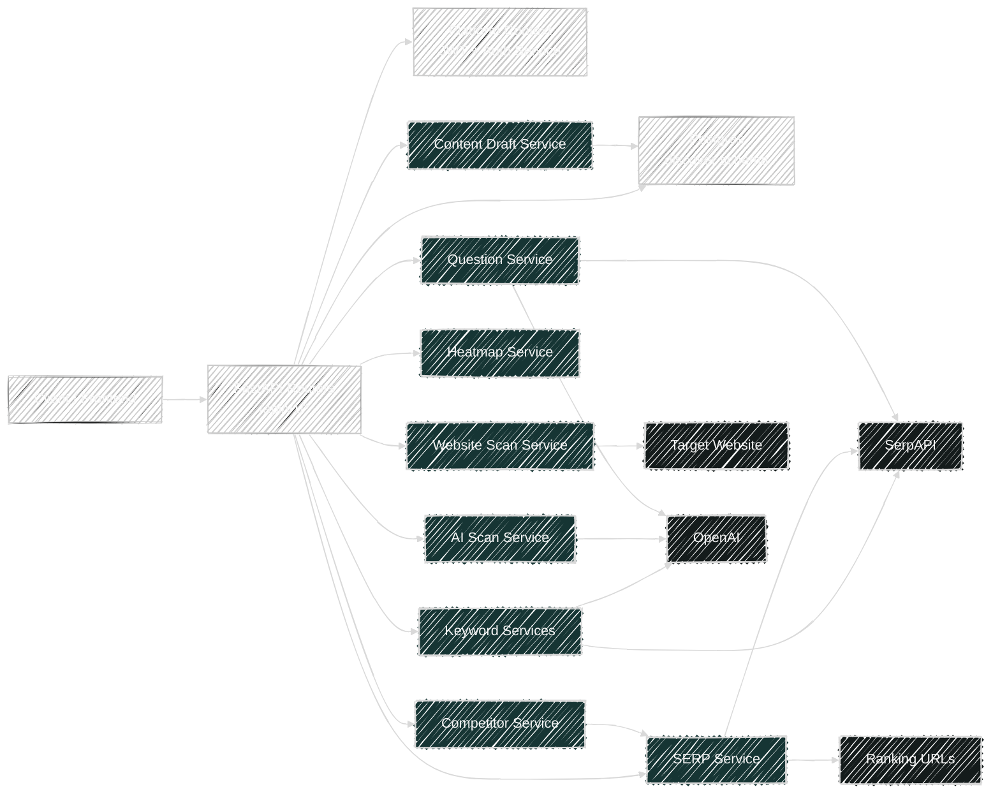

# Backend Data Flows

Backend scope only. This set documents the FastAPI routes under `backend/app/routers`, the handler functions behind them, what each handler does, and the internal/external dependencies each flow touches.

## API Mounting

- App entrypoint: `backend/app/main.py`
- Global API prefix: `/api/v1`
- Mounted routers:
  - `/onboarding`
  - `/keywords`
  - `/serp`
  - `/ai-scan`
  - `/heatmap`
  - `/questions`
  - `/competitors`
  - `/content`
- Non-router endpoint:
  - `GET /health`

## Shared Runtime Components

- Auth and project context: `backend/app/core/platform.py`
  - `get_request_token()` extracts JWT from `Authorization` header or `orbit_token` cookie.
  - `decode_token()` validates the JWT with `jwt_secret_key`.
  - `get_current_user()` builds `CurrentUser`.
  - `get_project_context()` loads project + brand from the Auth Service and enforces organization ownership.
  - `update_brand_profile()` and `update_project_profile()` write back to the Auth Service.
  - `project_scope_filters()` injects `organization_id`, `brand_id`, and `project_id` filters into queries.
- Database session: `backend/app/database.py`
  - `get_db()` opens an async SQLAlchemy session, sets `search_path`, commits on success, rolls back on failure.
  - `create_tables()` ensures the `discover` schema exists and creates local tables.
- Persistence schema: `backend/app/models.py`
  - All workflow tables are under the `discover` PostgreSQL schema.
  - Tenant scoping is enforced with `organization_id`, `brand_id`, and `project_id`.

## Route Inventory

| Area | Route | Handler |
| --- | --- | --- |
| Onboarding | `POST /api/v1/onboarding/start` | `start_onboarding()` |
| Onboarding | `POST /api/v1/onboarding/scan` | `rerun_website_scan()` |
| Onboarding | `GET /api/v1/onboarding/{project_id}` | `get_onboarding()` |
| Keywords | `POST /api/v1/keywords/expand` | `keyword_expand()` |
| Keywords | `GET /api/v1/keywords/{project_id}` | `get_keywords()` |
| Keywords | `GET /api/v1/keywords/opportunities/{project_id}` | `get_keyword_opportunities()` |
| Keywords | `POST /api/v1/keywords/select` | `select_keyword_opportunities()` |
| SERP | `POST /api/v1/serp/analyze` | `serp_analyze()` |
| SERP | `GET /api/v1/serp/{project_id}?query=...` | `get_serp_results()` |
| SERP | `GET /api/v1/serp/{project_id}/count` | `get_serp_count()` |
| AI Scan | `POST /api/v1/ai-scan` | `run_ai_scan()` |
| AI Scan | `GET /api/v1/ai-scan/{project_id}?query=...` | `get_ai_scan()` |
| AI Scan | `GET /api/v1/ai-scan/{project_id}/count` | `get_ai_scan_count()` |
| Heatmap | `GET /api/v1/heatmap/{project_id}?query=...` | `get_heatmap()` |
| Questions | `POST /api/v1/questions/mine` | `mine()` |
| Questions | `GET /api/v1/questions/{project_id}?topic=...` | `get_questions()` |
| Questions | `GET /api/v1/questions/{project_id}/count` | `get_questions_count()` |
| Competitors | `POST /api/v1/competitors/discover` | `discover_project_competitors()` |
| Competitors | `GET /api/v1/competitors/{project_id}` | `get_project_competitors()` |
| Content | `POST /api/v1/content/generate` | `generate_content()` |
| Content | `GET /api/v1/content/{project_id}` | `list_content()` |
| Content | `GET /api/v1/content/draft/{draft_id}` | `get_content_draft()` |

## Docs By Flow

- [Onboarding](./onboarding.md)
- [Keywords](./keywords.md)
- [SERP](./serp.md)
- [AI Scan](./ai-scan.md)
- [Heatmap](./heatmap.md)
- [Questions](./questions.md)
- [Competitors](./competitors.md)
- [Content](./content.md)

## High-Level Backend Map

## Important Behavioral Notes

- Most business routes depend on both `get_current_user()` and `get_project_context()`.
- `get_project_context()` makes outbound HTTP calls to the Auth Service for project and brand lookup.
- Several services degrade to empty results when API keys are missing:
  - `keyword_service.expand_keywords()` returns empty clusters if `SERPAPI_KEY` is absent.
  - `serp_service.analyze_serp()` returns `[]` if `SERPAPI_KEY` is absent.
  - `ai_scan_service.query_openai()` returns `{}` if `OPENAI_API_KEY` is absent.
  - `question_service.fetch_paa_questions()` and `generate_ai_questions()` both return `[]` when their provider keys are absent.
- `GET /api/v1/heatmap/{project_id}` is derived only from stored `SerpResult` and `AiScanResult` rows. It does not fetch live data itself.
- `GET /api/v1/content/draft/{draft_id}` is the only content route that does not call `get_project_context()`. It validates org/brand/project scope directly from headers/cookies and the authenticated user.
