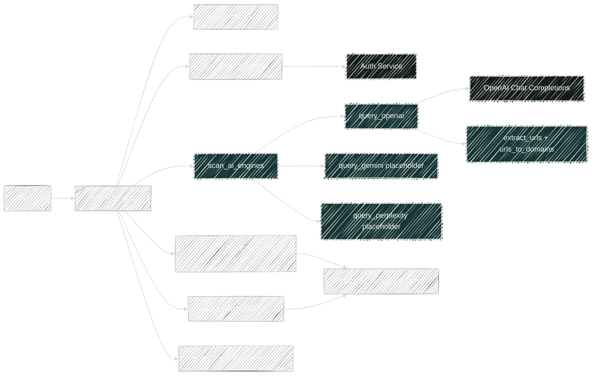
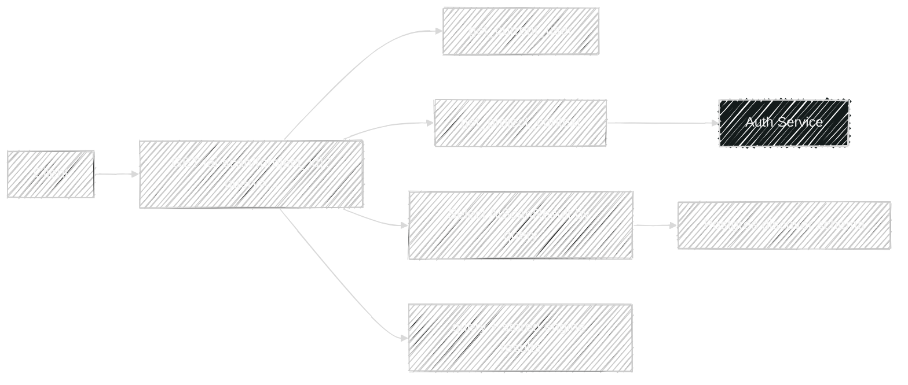
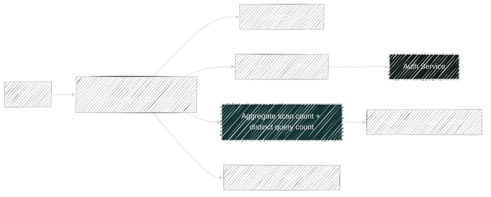

# AI Scan Flows

Router file: `backend/app/routers/ai_scan.py`

## `POST /api/v1/ai-scan`

Handler: `run_ai_scan()`

What it does:

- Resolves project context.
- Calls `scan_ai_engines(query, engines)`.
- Deletes old `AiScanResult` rows for the same scoped project + query.
- Persists one `AiScanResult` row per engine response.
- Returns the query and per-engine answer metadata.

Direct dependencies:

- Platform:
  - `get_project_context()`
  - `project_scope_filters()`
- Service:
  - `scan_ai_engines()`
- Model written:
  - `AiScanResult`

Transitive service dependencies:

- `scan_ai_engines()`
  - `query_openai()`
  - `query_gemini()` placeholder returning `{}`
  - `query_perplexity()` placeholder returning `{}`
  - `extract_urls()`
  - `urls_to_domains()`
- External:
  - OpenAI chat completions for the `openai` engine

## `GET /api/v1/ai-scan/{project_id}?query=...`

Handler: `get_ai_scan()`

What it does:

- Resolves project context.
- Reads all scoped `AiScanResult` rows for the query.
- Maps them into the response shape without re-calling any engine.

Dependencies:

- Platform:
  - `get_project_context()`
  - `project_scope_filters()`
- Model read:
  - `AiScanResult`

## `GET /api/v1/ai-scan/{project_id}/count`

Handler: `get_ai_scan_count()`

What it does:

- Resolves project context.
- Aggregates:
  - `count(AiScanResult.id)` as `total_scans`
  - `count(distinct(AiScanResult.query))` as `total_queries`
- Returns summary counts only.

Dependencies:

- Platform:
  - `get_project_context()`
  - `project_scope_filters()`
- Model read:
  - `AiScanResult`

