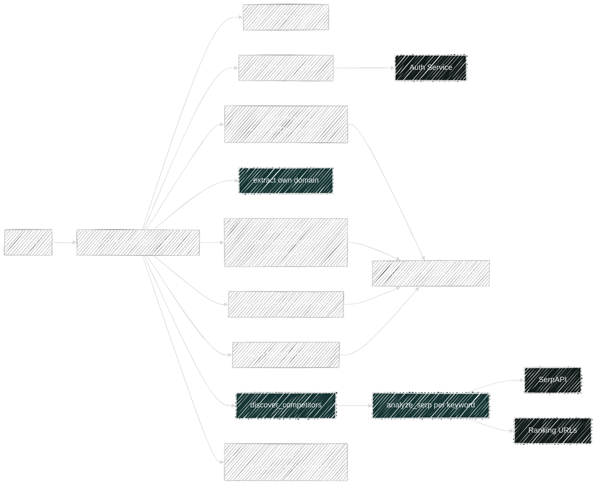
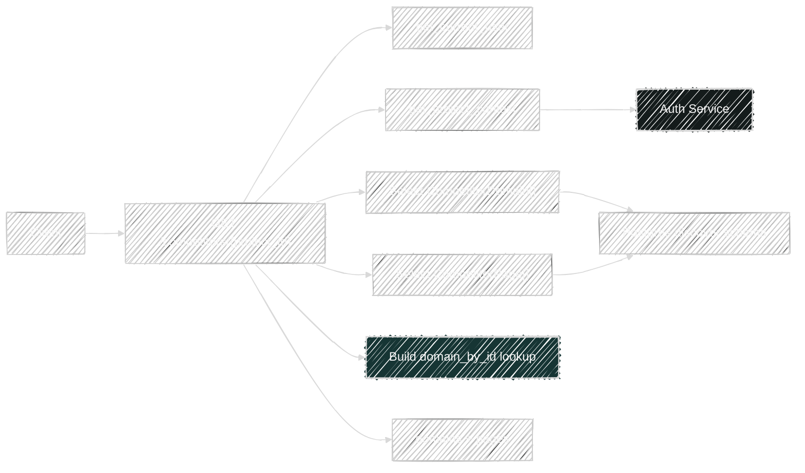

# Competitor Flows

Router file: `backend/app/routers/competitors.py`

## `POST /api/v1/competitors/discover`

Handler: `discover_project_competitors()`

What it does:

- Resolves project context.
- Reads scoped `KeywordOpportunity` rows where `selected = true`.
- Returns an API error payload if no selected keywords exist.
- Determines the brand's own domain from `primary_domain` or `website_url`.
- Calls `discover_competitors(selected_keywords, own_domain, num_results)`.
- Deletes old competitor data for the project:
  - `CompetitorPage`
  - `CompetitorDomain`
- Persists ranked competitor domains.
- Flushes each new domain row to build a `domain_id_by_name` map.
- Persists competitor pages linked back to the domain rows.
- Reuses `get_project_competitors()` to produce the final response shape.

Direct dependencies:

- Platform:
  - `get_project_context()`
  - `project_scope_filters()`
- Services:
  - `discover_competitors()`
  - `extract_domain()`
- Models read:
  - `KeywordOpportunity`
- Models deleted/written:
  - `CompetitorDomain`
  - `CompetitorPage`

Transitive service dependencies:

- `discover_competitors()`
  - loops over selected keywords
  - calls `analyze_serp()` for each keyword
  - filters out the brand's own domain and child domains via `_same_or_child_domain()`
  - computes visibility and average position
  - returns domain rollups and capped page samples
- `analyze_serp()` further depends on SerpAPI and page scraping

## `GET /api/v1/competitors/{project_id}`

Handler: `get_project_competitors()`

What it does:

- Resolves project context.
- Reads scoped `CompetitorDomain` rows ordered by `visibility_score desc`.
- Reads scoped `CompetitorPage` rows ordered by `position asc`.
- Builds an in-memory `domain_by_id` lookup.
- Returns normalized domain and page arrays.

Dependencies:

- Platform:
  - `get_project_context()`
  - `project_scope_filters()`
- Models read:
  - `CompetitorDomain`
  - `CompetitorPage`

