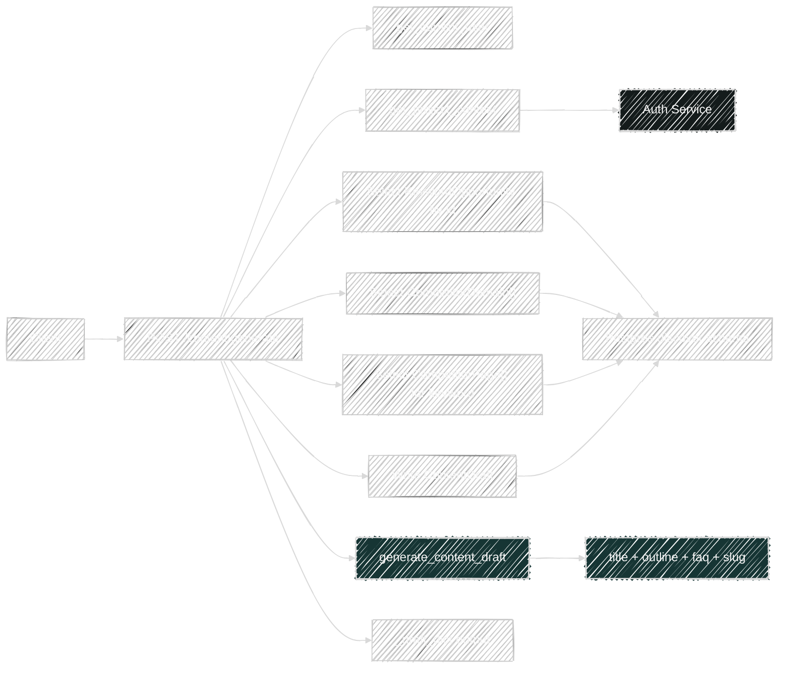
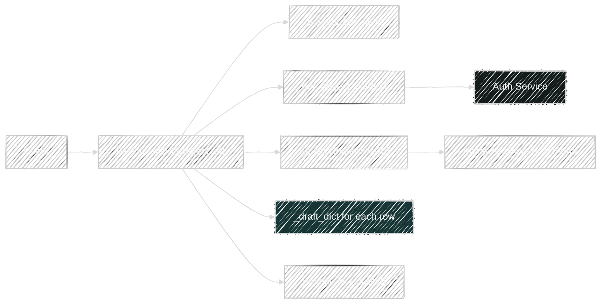
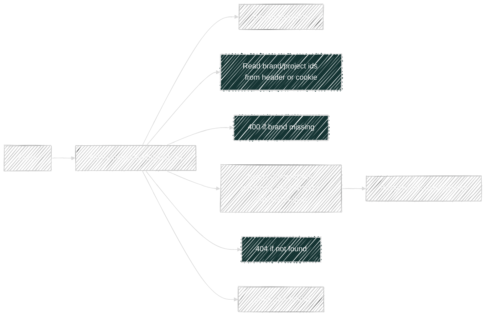

# Content Flows

Router file: `backend/app/routers/content.py`

## `POST /api/v1/content/generate`

Handler: `generate_content()`

What it does:

- Resolves project context.
- Loads the requested `KeywordOpportunity` by scoped `keyword_id`.
- Raises `404` if the keyword opportunity does not exist.
- Reads all scoped `CompetitorDomain` rows and builds `domain_by_id`.
- Reads scoped `CompetitorPage` rows for that keyword.
- Calls `generate_content_draft()` with:
  - selected keyword
  - intent
  - requested content type and tone
  - brand/project profile summary
  - lightweight competitor page context
- Persists a new `ContentDraft`.
- Flushes and refreshes the draft row.
- Returns the normalized draft via `_draft_dict()`.

Direct dependencies:

- Platform:
  - `get_project_context()`
  - `project_scope_filters()`
- Service:
  - `generate_content_draft()`
- Models read:
  - `KeywordOpportunity`
  - `CompetitorDomain`
  - `CompetitorPage`
- Model written:
  - `ContentDraft`
- Helper:
  - `_draft_dict()`

Transitive service dependencies:

- `generate_content_draft()`
  - `slugify()`
  - `_title()`
  - `_outline()`
  - `_faq()`
- No live external API calls in the current implementation

## `GET /api/v1/content/{project_id}`

Handler: `list_content()`

What it does:

- Resolves project context.
- Reads all scoped `ContentDraft` rows ordered by `created_at desc`.
- Maps each row with `_draft_dict()`.
- Returns a project-scoped draft list.

Dependencies:

- Platform:
  - `get_project_context()`
  - `project_scope_filters()`
- Model read:
  - `ContentDraft`
- Helper:
  - `_draft_dict()`

## `GET /api/v1/content/draft/{draft_id}`

Handler: `get_content_draft()`

What it does:

- Reads `brand_id` from `x-orbita-brand-id` header or `orbit_brand_id` cookie.
- Returns `400` if brand context is missing.
- Starts a direct `ContentDraft` query scoped by:
  - `draft_id`
  - authenticated user's `org_id`
  - `brand_id`
- Optionally narrows the query with `project_id` from header/cookie if present.
- Returns `404` if no matching draft is found.
- Returns the normalized row through `_draft_dict()`.

Important difference from other routes:

- This route does not call `get_project_context()`.
- It scopes access directly from request headers/cookies plus `current_user.org_id`.

Dependencies:

- Auth:
  - `get_current_user()`
- Model read:
  - `ContentDraft`
- Helper:
  - `_draft_dict()`

