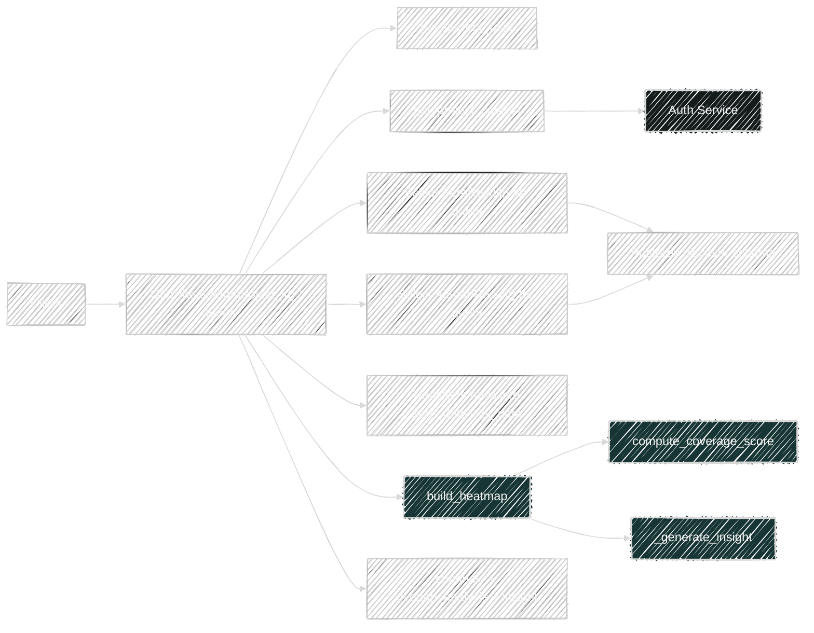

# Heatmap Flow

Router file: `backend/app/routers/heatmap.py`

## `GET /api/v1/heatmap/{project_id}?query=...`

Handler: `get_heatmap()`

What it does:

- Resolves project context.
- Reads stored `SerpResult` rows for the query.
- Reads stored `AiScanResult` rows for the query.
- Converts both datasets into compact domain coverage payloads.
- Returns an error if both datasets are empty.
- Calls `build_heatmap(query, serp_data, ai_data)`.
- Returns a single-row intent/coverage comparison structure.

Direct dependencies:

- Platform:
  - `get_project_context()`
  - `project_scope_filters()`
- Service:
  - `build_heatmap()`
- Models read:
  - `SerpResult`
  - `AiScanResult`

Transitive service dependencies:

- `build_heatmap()`
  - `compute_coverage_score()`
  - `_generate_insight()`
- No live outbound API requests in this route

Upstream prerequisites:

- `POST /api/v1/serp/analyze`
- `POST /api/v1/ai-scan`

