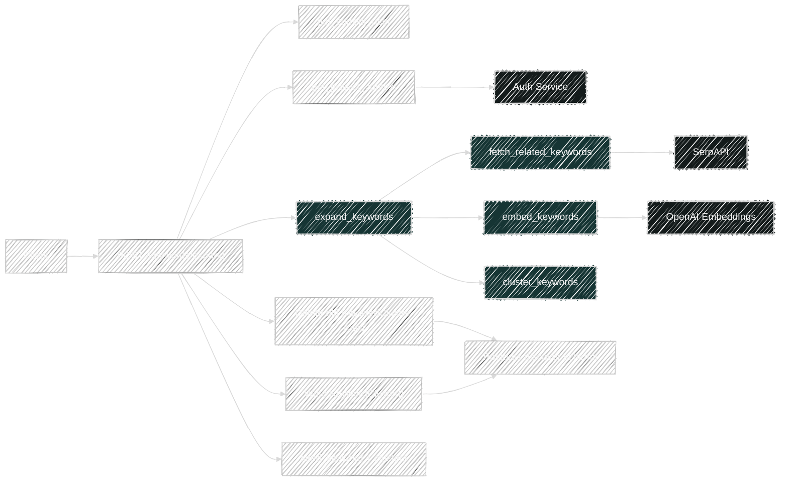
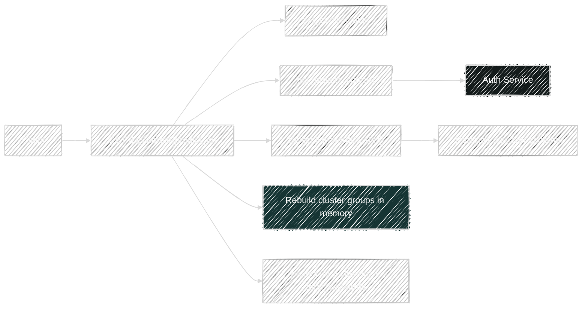
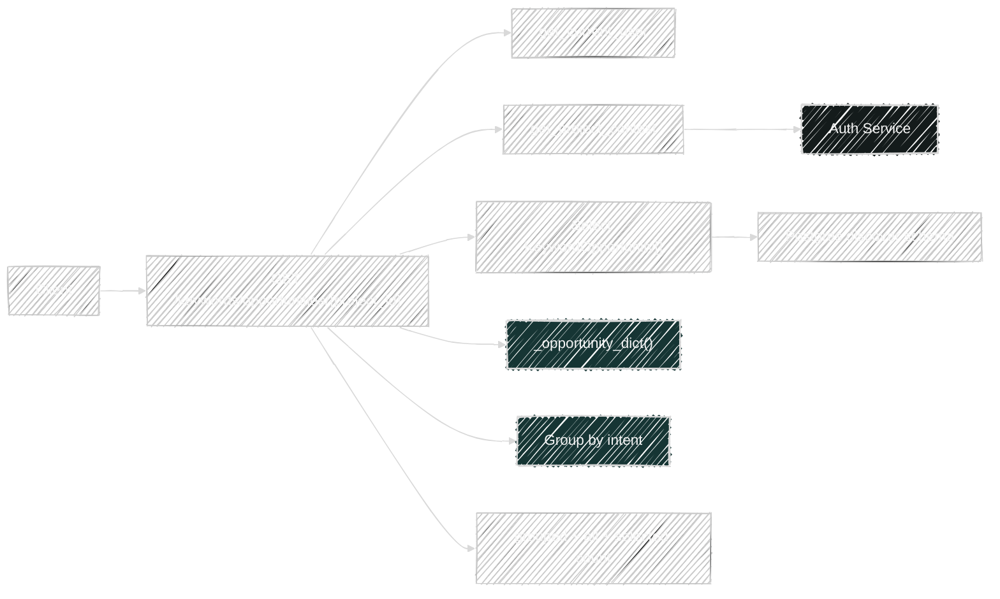
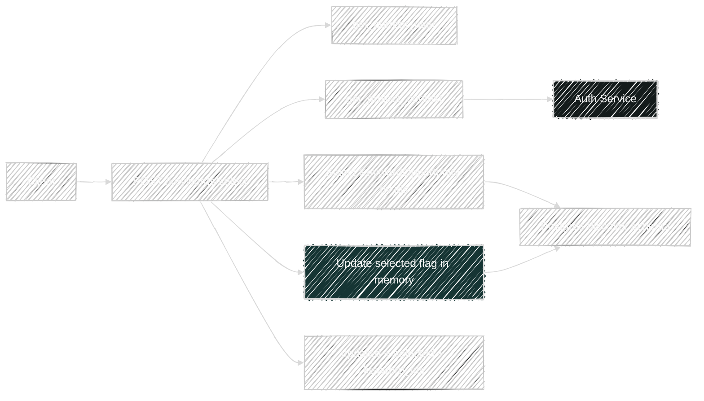

# Keyword Flows

Router file: `backend/app/routers/keywords.py`

## `POST /api/v1/keywords/expand`

Handler: `keyword_expand()`

What it does:

- Resolves scoped project context.
- Calls `expand_keywords(seed_keyword, limit)`.
- Deletes old `KeywordCluster` rows for the same `project_id` + `seed_keyword`.
- Persists new `KeywordCluster` rows from the clustering output.
- Returns the raw keyword clustering result.

Direct code dependencies:

- Platform:
  - `get_project_context()`
  - `project_scope_filters()`
- Service:
  - `expand_keywords()`
- Model written:
  - `KeywordCluster`

Transitive service dependencies in `expand_keywords()`:

- `fetch_related_keywords()` from SerpAPI
- `embed_keywords()` using OpenAI `text-embedding-3-small`
- `cluster_keywords()` using scikit-learn `KMeans`
- `classify_intent()` and `pick_cluster_name()`

## `GET /api/v1/keywords/{project_id}`

Handler: `get_keywords()`

What it does:

- Resolves project context.
- Reads all scoped `KeywordCluster` rows ordered by `cluster_id`.
- Reconstructs response groups in memory into `{cluster_id, cluster_name, intent, keywords[]}`.
- Returns grouped clusters plus `total_keywords`.

Dependencies:

- Platform:
  - `get_project_context()`
  - `project_scope_filters()`
- Model read:
  - `KeywordCluster`

## `GET /api/v1/keywords/opportunities/{project_id}`

Handler: `get_keyword_opportunities()`

What it does:

- Resolves project context.
- Reads all scoped `KeywordOpportunity` rows ordered by `intent` and `relevance_score desc`.
- Groups them into intent buckets.
- Uses `_opportunity_dict()` to normalize row output.
- Returns grouped and flattened views plus selected counts.

Dependencies:

- Platform:
  - `get_project_context()`
  - `project_scope_filters()`
- Model read:
  - `KeywordOpportunity`
- Helper:
  - `_opportunity_dict()`

## `POST /api/v1/keywords/select`

Handler: `select_keyword_opportunities()`

What it does:

- Resolves project context.
- Short-circuits with `updated: 0` if `keyword_ids` is empty.
- Selects the scoped `KeywordOpportunity` rows matching the supplied IDs.
- Mutates each row's `selected` flag to the requested boolean.
- Returns the updated IDs and count.

Dependencies:

- Platform:
  - `get_project_context()`
  - `project_scope_filters()`
- Model updated:
  - `KeywordOpportunity`

