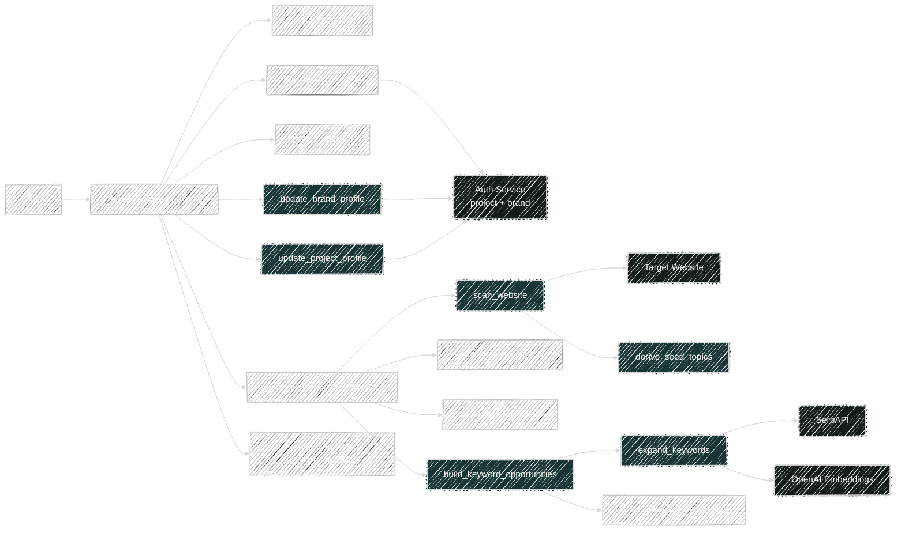
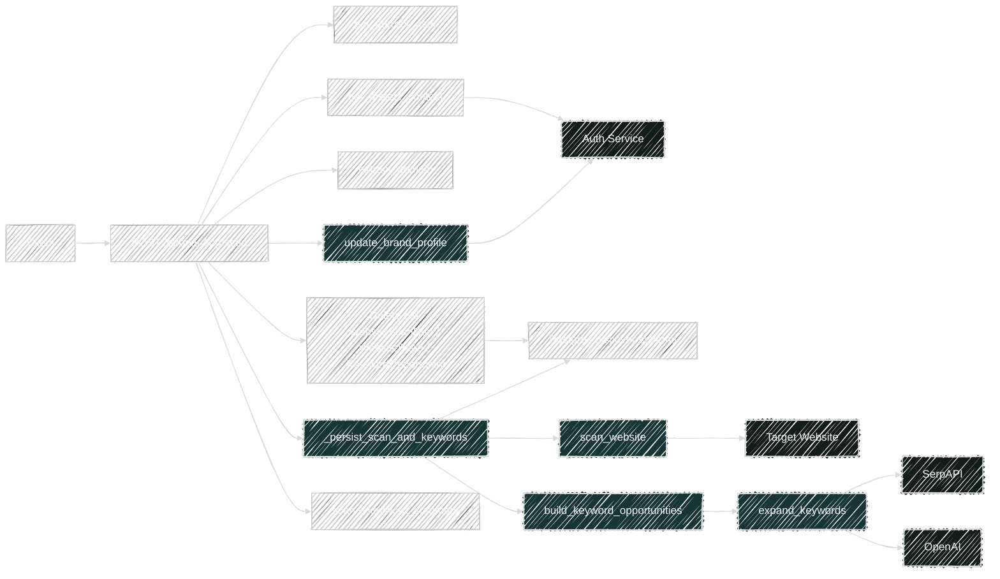
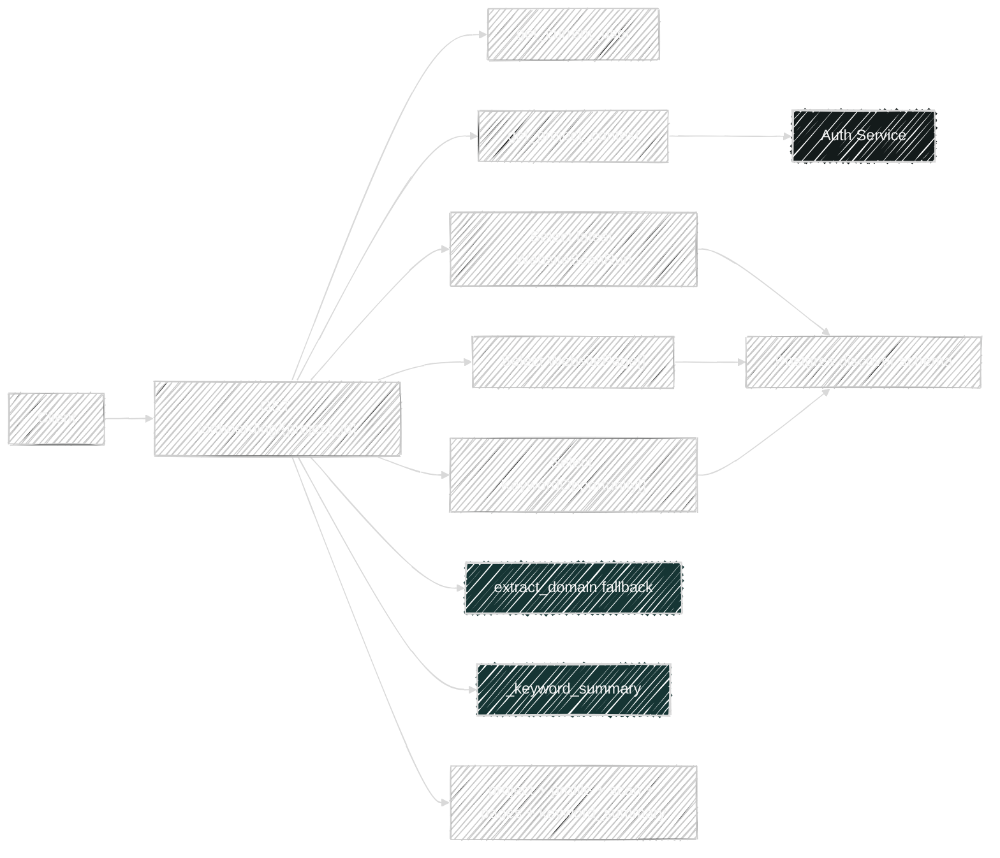

# Onboarding Flows

Router file: `backend/app/routers/onboarding.py`

## Shared Handler Dependencies

- `Depends(get_db)` for the async SQLAlchemy session
- `Depends(get_current_user)` for JWT-authenticated user context
- `get_project_context()` for project + brand hydration from the Auth Service
- `_persist_scan_and_keywords()` as the core onboarding pipeline
- `_keyword_summary()` to reshape keyword opportunity stats for the API response

## `POST /api/v1/onboarding/start`

Handler: `start_onboarding()`

What it does:

- Validates `website_url` with `extract_domain()`.
- Resolves tenant and project scope with `get_project_context()`.
- Runs `_persist_scan_and_keywords()`:
  - `scan_website()` crawls the website and derives seed topics.
  - Persists `WebsiteScanRun`.
  - Persists one `WebsitePage` row per scanned page.
  - Calls `build_keyword_opportunities()` to derive keyword ideas from seed topics.
  - Persists `KeywordOpportunity` rows.
- Updates shared platform records:
  - `update_brand_profile()` writes company and website fields back to the Auth Service.
  - `update_project_profile()` writes `target_audience` to the project.
- Returns a composed response with project profile, scan summary, and keyword summary.

Direct code dependencies:

- Helpers:
  - `_persist_scan_and_keywords()`
  - `_keyword_summary()`
- Platform:
  - `get_project_context()`
  - `update_brand_profile()`
  - `update_project_profile()`
- Services:
  - `extract_domain()`
  - `scan_website()`
  - `build_keyword_opportunities()`
- Models written:
  - `WebsiteScanRun`
  - `WebsitePage`
  - `KeywordOpportunity`

Transitive service dependencies:

- `scan_website()`
  - `normalize_url()`
  - `extract_domain()`
  - `_discover_internal_links()`
  - `_parse_page()`
  - `derive_seed_topics()`
  - external: target website via `httpx`, HTML parsing via `BeautifulSoup`
- `build_keyword_opportunities()`
  - `expand_keywords()`
  - `normalize_keyword()`
  - `score_relevance()`
  - `score_intent()`
  - `classify_intent()`
  - external: SerpAPI, OpenAI embeddings, scikit-learn KMeans through `expand_keywords()`

## `POST /api/v1/onboarding/scan`

Handler: `rerun_website_scan()`

What it does:

- Validates `website_url`.
- Resolves scoped project context.
- Derives `company_name`, `industry`, and `target_audience` from current project/brand state.
- Deletes previous onboarding scan data for the project:
  - `KeywordOpportunity`
  - `WebsitePage`
  - `WebsiteScanRun`
- Reuses `_persist_scan_and_keywords()` to rebuild the scan and opportunities.
- Calls `update_brand_profile()` to refresh `website_url` and `primary_domain`.
- Returns fresh scan and keyword summary payloads.

Direct code dependencies:

- Platform:
  - `get_project_context()`
  - `update_brand_profile()`
  - `project_scope_filters()`
- Services:
  - `extract_domain()`
  - `scan_website()`
  - `build_keyword_opportunities()`
- Models deleted and rewritten:
  - `KeywordOpportunity`
  - `WebsitePage`
  - `WebsiteScanRun`

## `GET /api/v1/onboarding/{project_id}`

Handler: `get_onboarding()`

What it does:

- Resolves project and brand context through the Auth Service.
- Reads the latest `WebsiteScanRun` for the project.
- Reads all scoped `WebsitePage` rows.
- Reads all scoped `KeywordOpportunity` rows.
- Falls back to `extract_domain(scan.website_url)` if the brand does not already store `primary_domain`.
- Returns current project profile state plus scan/page/keyword summary data.

Direct code dependencies:

- Platform:
  - `get_project_context()`
  - `project_scope_filters()`
- Services:
  - `extract_domain()` for fallback domain derivation
- Models read:
  - `WebsiteScanRun`
  - `WebsitePage`
  - `KeywordOpportunity`
- Response helper:
  - `_keyword_summary()`

