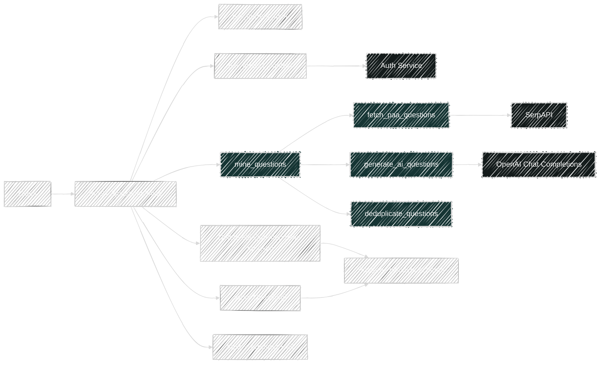
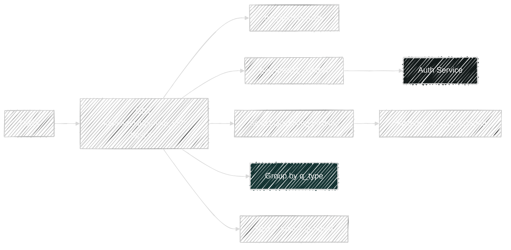
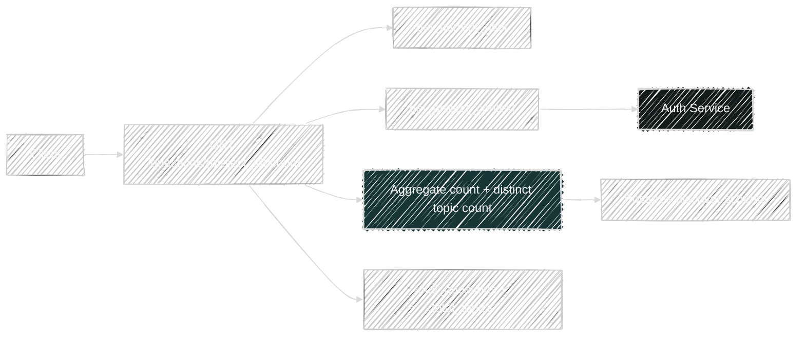

# Question Flows

Router file: `backend/app/routers/questions.py`

## `POST /api/v1/questions/mine`

Handler: `mine()`

What it does:

- Resolves project context.
- Calls `mine_questions(topic)`.
- Deletes old `Question` rows for the same scoped project + topic.
- Persists the new mined questions.
- Builds a grouped response keyed by `q_type`.

Direct dependencies:

- Platform:
  - `get_project_context()`
  - `project_scope_filters()`
- Service:
  - `mine_questions()`
- Model written:
  - `Question`

Transitive service dependencies:

- `mine_questions()`
  - `fetch_paa_questions()` via SerpAPI
  - `generate_ai_questions()` via OpenAI
  - `deduplicate_questions()`
  - `classify_q_type()`

## `GET /api/v1/questions/{project_id}?topic=...`

Handler: `get_questions()`

What it does:

- Resolves project context.
- Selects scoped `Question` rows for the requested topic.
- Orders them by `q_type`.
- Rebuilds grouped output in memory.

Dependencies:

- Platform:
  - `get_project_context()`
  - `project_scope_filters()`
- Model read:
  - `Question`

## `GET /api/v1/questions/{project_id}/count`

Handler: `get_questions_count()`

What it does:

- Resolves project context.
- Aggregates:
  - `count(Question.id)` as `total_questions`
  - `count(distinct(Question.topic))` as `total_topics`
- Returns only the aggregate counts.

Dependencies:

- Platform:
  - `get_project_context()`
  - `project_scope_filters()`
- Model read:
  - `Question`

