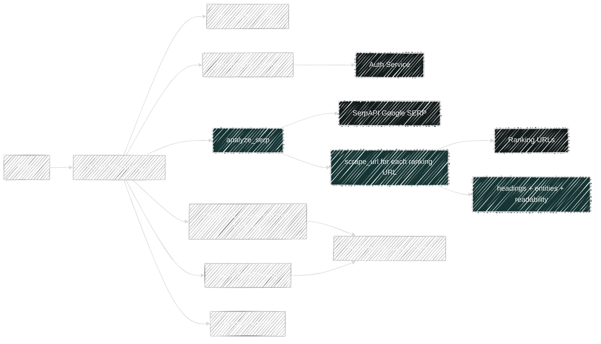
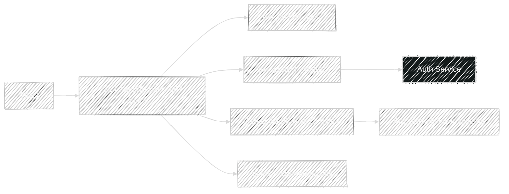
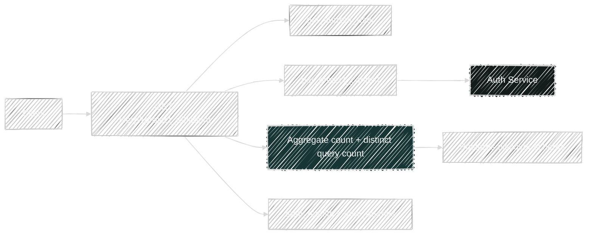

# SERP Flows

Router file: `backend/app/routers/serp.py`

## `POST /api/v1/serp/analyze`

Handler: `serp_analyze()`

What it does:

- Resolves project context.
- Calls `analyze_serp(query, num_results)`.
- Deletes old `SerpResult` rows for the same scoped project + query.
- Persists the fresh SERP result set.
- Returns the query plus enriched ranking results.

Direct dependencies:

- Platform:
  - `get_project_context()`
  - `project_scope_filters()`
- Service:
  - `analyze_serp()`
- Model written:
  - `SerpResult`

Transitive service dependencies in `analyze_serp()`:

- `SerpAPI` Google search request
- `scrape_url()` for each organic result
- `extract_domain()`
- `rough_readability()`
- `extract_entities_simple()`
- `BeautifulSoup` for heading extraction

## `GET /api/v1/serp/{project_id}?query=...`

Handler: `get_serp_results()`

What it does:

- Resolves project context.
- Selects scoped `SerpResult` rows for the requested query.
- Orders them by position.
- Maps DB rows into the API response shape.

Dependencies:

- Platform:
  - `get_project_context()`
  - `project_scope_filters()`
- Model read:
  - `SerpResult`

## `GET /api/v1/serp/{project_id}/count`

Handler: `get_serp_count()`

What it does:

- Resolves project context.
- Runs a scoped aggregate query:
  - `count(SerpResult.id)` as `total_results`
  - `count(distinct(SerpResult.query))` as `total_queries`
- Returns the counts only.

Dependencies:

- Platform:
  - `get_project_context()`
  - `project_scope_filters()`
- Model read:
  - `SerpResult`
- SQL functions:
  - `func.count`
  - `distinct`

