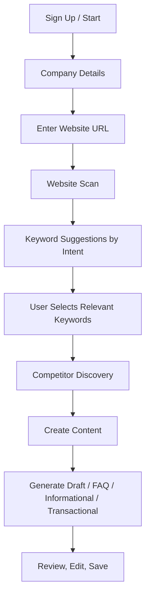

# Discover Orbit SEO Onboarding Implementation Guide

## Purpose

This document translates the latest client requirement into a concrete product, architecture, API, data, and rollout plan for the current Discover Orbit codebase.

The goal is to move the app from a **research-tool workspace** into a **guided beginner-friendly SEO journey**:

1. User signs up / starts onboarding
2. User enters company details and website URL
3. System scans the website and extracts seed topics
4. System generates keywords across all 4 intent buckets
5. User selects the most relevant keywords
6. System finds ranking competitors for those keywords
7. User generates content from those keywords and competitor insights
8. User saves drafts / iterates / exports

## Important interpretation of the client requirement

The current codebase already uses 4 search-intent buckets in `backend/app/services/keyword_service.py`:

- `informational`
- `commercial`
- `transactional`
- `navigational`

That matches the client’s “informational, transactional, and the other two” requirement.

Recommended product copy:

- `Informational`: education / awareness
- `Commercial`: comparison / evaluation
- `Transactional`: high-intent / ready to buy
- `Navigational`: brand / destination seeking

Also note:

- “High intent” should be treated as a combination of `commercial` and `transactional`
- “Intentional” in the client note is likely a typo for `transactional` or “high-intent”

## Current project summary

### What the app is today

The existing product is a modular SEO research MVP:

- Backend: FastAPI + SQLAlchemy async + PostgreSQL
- Frontend: React + Vite + React Query + Zustand + Tailwind
- Modules: Projects, Keywords, SERP Analyzer, AI Scan, Heatmap, Questions

Current architecture references:

- App entry and routers: `backend/app/main.py`
- Data models: `backend/app/models.py`
- Keyword generation: `backend/app/services/keyword_service.py`
- SERP analysis and page scraping: `backend/app/services/serp_service.py`
- Question mining: `backend/app/services/question_service.py`
- API client: `frontend/src/api/client.ts`
- Layout / sidebar navigation: `frontend/src/components/Layout.tsx`
- Current dashboard workflow: `frontend/src/pages/Dashboard.tsx`
- Current keyword page: `frontend/src/pages/Keywords.tsx`

### What already exists that can be reused

These parts are valuable and should be reused, not replaced:

- Keyword expansion pipeline
- Intent classification model
- SERP competitor lookup capability
- SERP page scraping and heading extraction
- Question mining for FAQ-style content
- Existing project-level storage pattern
- React Query data-fetching setup

### What is missing today

The current codebase does **not** yet support:

- real signup/authentication
- company onboarding
- website URL-based content discovery
- website crawl/page inventory
- keyword selection and approval workflow
- competitor aggregation for selected keywords
- content generation or content drafts
- guided step-by-step onboarding UX
- background jobs for long-running scan/generation flows
- migration-based schema evolution

## Architecture gap analysis

### 1. Product flow gap

Today the user journey starts with:

- create/select project
- manually open a tool page
- manually enter seed keywords or queries

Client requirement needs:

- guided onboarding
- no SEO expertise assumed
- website-first input, not manual keyword-first input

### 2. Data model gap

Current persistence is too shallow for the new workflow.

Examples:

- `Project` only stores `name` and `description`
- `KeywordCluster` stores generated keywords but not whether user selected them
- `SerpResult` stores per-query ranking data but not competitor rollups
- `Question` stores FAQ-style questions but not content drafts

### 3. Backend orchestration gap

Current routers are synchronous request/response flows:

- `/keywords/expand`
- `/serp/analyze`
- `/ai-scan`
- `/questions/mine`

That works for lightweight actions, but website crawling plus multi-keyword competitor analysis plus content generation should become job-based or at least staged workflows.

### 4. Frontend UX gap

Current navigation is tool-centric in the sidebar. A beginner-friendly client flow needs a **wizard or guided dashboard** that walks the user through one recommended next action at a time.

## Recommended target journey



### Recommended UX behavior

1. Onboarding step 1: company and website
2. Onboarding step 2: scan results summary
3. Onboarding step 3: keyword review by intent
4. Onboarding step 4: competitor review
5. Onboarding step 5: content generation
6. Advanced tools remain available as secondary research views

This preserves the current investment in research modules while making the primary user experience simpler.

## Recommended implementation strategy

## A. Product and route restructuring

### Current state

The app is built around standalone routes:

- `/`
- `/keywords`
- `/serp`
- `/ai-scan`
- `/heatmap`
- `/questions`

### Recommended state

Add a new primary flow:

- `/onboarding`
- `/onboarding/company`
- `/onboarding/website-scan`
- `/onboarding/keywords`
- `/onboarding/competitors`
- `/content`
- `/content/new`
- `/content/:draftId`

Keep current pages under an advanced/research grouping:

- `/research/keywords`
- `/research/serp`
- `/research/ai-scan`
- `/research/heatmap`
- `/research/questions`

### Frontend impact

Files that would need change or addition:

- `frontend/src/App.tsx`
- `frontend/src/components/Layout.tsx`
- `frontend/src/store/projectStore.ts`
- `frontend/src/api/client.ts`
- new onboarding pages/components
- new content generation pages/components

## B. Data model changes

### Current tables

From `backend/app/models.py`:

- `projects`
- `keyword_clusters`
- `serp_results`
- `ai_scan_results`
- `questions`

### Recommended new/changed tables

#### 1. `projects` table

Extend or normalize project onboarding data.

Recommended new fields if staying simple:

- `website_url`
- `company_name`
- `industry`
- `target_audience`
- `country`
- `onboarding_status`
- `primary_domain`
- `website_scan_status`
- `selected_content_goal`

Recommended alternative:

- keep `projects` lightweight
- create `company_profiles`

#### 2. `website_pages`

Purpose:

- store crawled pages from the user’s website
- support keyword extraction from real site content

Suggested fields:

- `id`
- `project_id`
- `url`
- `page_type`
- `title`
- `meta_description`
- `h1`
- `headings_json`
- `body_excerpt`
- `word_count`
- `is_indexable`
- `crawl_status`
- `created_at`

#### 3. `website_scan_runs`

Purpose:

- track the scan lifecycle and auditability

Suggested fields:

- `id`
- `project_id`
- `status`
- `pages_discovered`
- `pages_scanned`
- `errors_json`
- `started_at`
- `completed_at`

#### 4. `keyword_opportunities`

Purpose:

- replace the current “generated and forget” keyword approach with a richer entity

Suggested fields:

- `id`
- `project_id`
- `source_run_id`
- `source_page_url`
- `seed_topic`
- `keyword`
- `normalized_keyword`
- `intent`
- `intent_score`
- `search_volume`
- `difficulty`
- `relevance_score`
- `cluster_name`
- `selected`
- `selection_notes`
- `created_at`

This can coexist with `keyword_clusters`, but long term `keyword_opportunities` is a better primary entity.

#### 5. `competitor_domains`

Purpose:

- aggregate domains ranking across selected keywords

Suggested fields:

- `id`
- `project_id`
- `domain`
- `avg_position`
- `ranking_keyword_count`
- `visibility_score`
- `top_keywords_json`
- `created_at`

#### 6. `competitor_pages`

Purpose:

- store high-value ranking pages from competitors

Suggested fields:

- `id`
- `project_id`
- `competitor_domain_id`
- `keyword_id`
- `keyword`
- `url`
- `title`
- `position`
- `headings_json`
- `entities_json`
- `word_count`
- `readability`
- `created_at`

#### 7. `content_briefs`

Purpose:

- intermediate artifact between keyword selection and draft generation

Suggested fields:

- `id`
- `project_id`
- `keyword_id`
- `primary_keyword`
- `intent`
- `content_type`
- `recommended_angle`
- `competitor_summary`
- `faq_questions_json`
- `outline_json`
- `created_at`

#### 8. `content_drafts`

Purpose:

- store generated content

Suggested fields:

- `id`
- `project_id`
- `content_brief_id`
- `title`
- `slug`
- `content_type`
- `intent`
- `status`
- `meta_title`
- `meta_description`
- `outline_json`
- `body_markdown`
- `faq_json`
- `created_at`
- `updated_at`

### Migration recommendation

Do not keep relying on `create_all()` as the primary schema evolution mechanism for this feature set.

Current startup behavior auto-creates tables in `backend/app/main.py` and `backend/app/database.py`. That is okay for an MVP, but not for the volume of schema changes needed here.

Recommended change:

- introduce proper Alembic migrations
- version all new schema changes
- stop treating production schema as “whatever models exist at startup”

## C. Backend service changes

## 1. New website scan service

### Why

The client flow starts from a website URL, but the current keyword pipeline starts from a manual `seed_keyword`.

### Add

- `backend/app/services/website_scan_service.py`

Responsibilities:

- normalize and validate website URL
- crawl a controlled subset of pages
- extract title, H1, headings, meta description, body text
- derive seed topics from site language
- identify core business terms from home, service, product, and about pages

### Implementation notes

Recommended crawl strategy for MVP:

- homepage first
- then same-domain internal pages only
- cap pages at 10 to 25
- prioritize navigation-linked pages
- skip PDFs, images, login pages, support portals, and external domains

This can reuse some extraction ideas from `backend/app/services/serp_service.py`.

## 2. Evolve keyword service from “manual seed expansion” to “website-driven keyword discovery”

### Current state

`expand_keywords(seed, limit)` takes one keyword and clusters related suggestions.

### Recommended evolution

Create a higher-level orchestration service:

- `discover_keywords_from_website(project_id, scan_run_id, limit_per_seed)`

Pipeline:

1. extract seed topics from scanned website pages
2. expand each seed with current `expand_keywords`
3. deduplicate across all seeds
4. classify into the 4 intent buckets
5. compute a relevance score to the user’s business
6. store as `keyword_opportunities`

### Reuse

Keep and reuse:

- `classify_intent`
- clustering
- SerpAPI keyword sourcing

### Important change

Today intent is only heuristic and returned per keyword. The new system should also:

- group results by intent section for UI
- mark high-intent keywords
- store selection state

## 3. New competitor discovery service

### Add

- `backend/app/services/competitor_service.py`

Responsibilities:

- for each selected keyword, run SERP analysis
- aggregate top-ranking domains
- exclude the user’s own domain
- compute a visibility score
- persist competitor rollups and page-level evidence

### Reuse

Reuse `analyze_serp` from `backend/app/services/serp_service.py` as the underlying data fetcher.

### Suggested algorithm

For each selected keyword:

1. fetch top 10 organic results
2. ignore the user’s own domain and subdomains
3. store position, URL, headings, entities
4. assign score, e.g. `11 - position`
5. sum scores across keywords by domain
6. rank domains by total visibility score

This gives a simple, explainable competitor ranking model.

## 4. New content generation service

### Add

- `backend/app/services/content_generation_service.py`

Responsibilities:

- generate content briefs
- generate outlines
- generate drafts by content type
- generate FAQ blocks
- use keyword intent plus competitor evidence plus question data

### Content types to support

Per client request and likely product needs:

- FAQ / Q&A
- Informational article
- Transactional landing page
- Comparison / commercial page

### Reuse

Reuse existing modules as inputs:

- `question_service.py` for FAQ discovery
- `serp_service.py` for competitor headings/entities
- current keyword intent classification

### Do not reuse directly

`ai_scan_service.py` is designed for “what do external AI engines answer?” It is not a true content authoring pipeline. It can remain as a supporting research tool, but content generation should be its own service.

## D. API design changes

## 1. Onboarding API

Add new router:

- `backend/app/routers/onboarding.py`

Suggested endpoints:

- `POST /api/v1/onboarding/start`
- `POST /api/v1/onboarding/company`
- `POST /api/v1/onboarding/website-scan`
- `GET /api/v1/onboarding/{project_id}`

Suggested payload for company setup:

```json
{
  "company_name": "Orbit",
  "website_url": "https://example.com",
  "industry": "SEO software",
  "target_audience": "small businesses",
  "country": "US"
}
```

## 2. Keyword review API

Suggested endpoints:

- `GET /api/v1/keywords/opportunities/{project_id}`
- `POST /api/v1/keywords/select`
- `POST /api/v1/keywords/unselect`

Suggested keyword-select payload:

```json
{
  "project_id": "project-id",
  "keyword_ids": ["kw-1", "kw-2", "kw-3"]
}
```

### Response should be grouped for the UI

Return:

- `informational`
- `commercial`
- `transactional`
- `navigational`

Each section should include:

- keyword
- relevance score
- intent
- selected boolean
- search volume
- difficulty
- why it was suggested

## 3. Competitor API

Add new router:

- `backend/app/routers/competitors.py`

Suggested endpoints:

- `POST /api/v1/competitors/discover`
- `GET /api/v1/competitors/{project_id}`
- `GET /api/v1/competitors/{project_id}/{domain}`

## 4. Content API

Add new router:

- `backend/app/routers/content.py`

Suggested endpoints:

- `POST /api/v1/content/brief`
- `POST /api/v1/content/generate`
- `GET /api/v1/content/{project_id}`
- `GET /api/v1/content/draft/{draft_id}`
- `PATCH /api/v1/content/draft/{draft_id}`

## 5. Job/status API

If website scanning and competitor discovery become async jobs, add:

- `GET /api/v1/jobs/{job_id}`

Statuses:

- `queued`
- `running`
- `completed`
- `failed`

## E. Frontend changes in detail

## 1. Layout and navigation

### Current state

`frontend/src/components/Layout.tsx` uses a tool-first sidebar.

### Recommended state

Make the default navigation journey-first:

- Overview
- Website Setup
- Keywords
- Competitors
- Content
- Research Tools

Recommended UX:

- show only the next recommended step prominently
- lock or visually de-emphasize later steps until prerequisites are complete
- retain current research modules behind a secondary nav section

## 2. Dashboard changes

### Current state

`frontend/src/pages/Dashboard.tsx` shows counts and workflow cards for research tools.

### Recommended state

Replace the current dashboard with an onboarding/status dashboard:

- onboarding progress bar
- website scan status
- keyword counts by intent
- selected keyword count
- top competitors found
- drafts created
- clear CTA button for the next step

## 3. Keyword page changes

### Current state

`frontend/src/pages/Keywords.tsx` is manual-seed driven.

### Recommended state

Turn it into a review-and-select experience.

New UI sections:

- grouped keywords by 4 intent buckets
- filters: all / high intent / selected
- relevance explanation
- bulk select / deselect
- “use selected keywords to find competitors”

Key UX rule:

Do not make the user type SEO terms unless the automatic website scan failed.

## 4. New competitors page

New page:

- `frontend/src/pages/Competitors.tsx`

Show:

- ranked competitor domains
- how many selected keywords each competitor ranks for
- top pages/headings
- quick summary of what they are covering
- CTA: “Generate content for this keyword”

## 5. New content generation page

New page:

- `frontend/src/pages/Content.tsx`

Required inputs:

- selected keyword
- intent
- content type
- optional tone / brand guidance

Outputs:

- title
- outline
- meta title
- meta description
- draft body
- FAQ section

## 6. API client expansion

Update `frontend/src/api/client.ts` with typed clients for:

- onboarding
- website scan
- keyword selection
- competitors
- content generation

This file is currently the central typed client layer and should remain that way.

## 7. Store changes

Current Zustand state only tracks:

- selected project
- last queries for some modules

Add persistent onboarding state:

- onboarding status
- website scan run id
- selected keyword ids
- active content brief id
- selected competitor domain

## F. Authentication and signup decision

## Reality check

The client explicitly says the user “signs up”, but the current project has no auth layer.

### Option 1. True SaaS signup

Add:

- users
- sessions
- organizations/workspaces
- project ownership

This is the correct production interpretation if the product is external-facing.

### Option 2. MVP onboarding only

Treat current “create project” as the temporary entry point and add:

- company details form
- website URL
- onboarding progression

This is faster if the immediate goal is demoing the client flow without a full auth build.

### Recommendation

For fastest delivery:

- Phase 1: onboarding without full auth
- Phase 2: real signup and account ownership

If the client specifically expects self-serve user accounts now, then auth must be included in scope immediately.

## G. Background jobs and performance

## Why this matters

Website crawl + keyword expansion + competitor discovery + content generation can become slow and fragile if everything stays inside synchronous HTTP requests.

## Current state

The repo has:

- Redis configured in infrastructure
- no actual job worker implementation in app code

## Recommendation

Introduce background execution for:

- website scans
- multi-keyword competitor discovery
- content generation

Recommended approach:

- use Redis-backed job processing
- return a job id from long-running endpoints
- poll job status from the frontend

This keeps the UI responsive and prevents request timeouts.

## H. Testing changes required

## Current testing shape

Backend tests cover:

- projects
- keywords
- serp
- ai scan
- heatmap
- questions

Frontend currently has no visible test suite.

## Add backend tests for

- onboarding setup flow
- website scan parsing
- keyword grouping by intent
- keyword selection persistence
- competitor aggregation scoring
- content brief generation
- content draft generation
- job status transitions

## Add frontend tests for

- onboarding step gating
- keyword selection UX
- competitor results rendering
- content generation form and result flow

Recommended frontend test stack:

- Vitest
- React Testing Library

## I. Rollout plan

## Phase 1. Guided onboarding foundation

Deliver:

- company details + website URL
- website scan
- keyword suggestions grouped into 4 intents
- keyword selection flow

No content generation yet.

## Phase 2. Competitor discovery

Deliver:

- competitor aggregation from selected keywords
- top competitor pages and insights

## Phase 3. Content generation

Deliver:

- FAQ generation
- informational draft generation
- transactional page generation
- commercial/comparison page generation

## Phase 4. Advanced polish

Deliver:

- auth/signup
- saved drafts and edits
- better scoring
- stronger export/share flows
- advanced research tools grouped separately

## J. Recommended file-level implementation map

## Backend

Change or add:

- `backend/app/main.py`
- `backend/app/models.py`
- `backend/app/schemas.py`
- `backend/app/config.py`
- `backend/app/routers/projects.py`
- `backend/app/routers/keywords.py`
- `backend/app/services/keyword_service.py`
- `backend/app/services/serp_service.py`
- `backend/app/routers/onboarding.py`
- `backend/app/routers/competitors.py`
- `backend/app/routers/content.py`
- `backend/app/services/website_scan_service.py`
- `backend/app/services/competitor_service.py`
- `backend/app/services/content_generation_service.py`
- Alembic migration files

## Frontend

Change or add:

- `frontend/src/App.tsx`
- `frontend/src/components/Layout.tsx`
- `frontend/src/api/client.ts`
- `frontend/src/store/projectStore.ts`
- `frontend/src/pages/Dashboard.tsx`
- `frontend/src/pages/Keywords.tsx`
- `frontend/src/pages/Competitors.tsx`
- `frontend/src/pages/Content.tsx`
- onboarding page/components under `frontend/src/pages` or `frontend/src/components`

## Tests

Add or change:

- `backend/tests/test_onboarding.py`
- `backend/tests/test_competitors.py`
- `backend/tests/test_content.py`
- updates to `backend/tests/conftest.py`
- frontend test setup and component tests

## K. Reuse map: keep vs replace

### Keep and adapt

- keyword intent classification
- keyword expansion logic
- SERP scraping logic
- question mining logic
- project selection pattern
- React Query API client structure

### Replace as primary UX

- current dashboard workflow
- manual keyword-first entry point
- tool-first navigation for beginner users

### Add net-new

- onboarding flow
- website scan service
- keyword selection workflow
- competitor aggregator
- content brief generator
- content draft generator
- async job model

## L. Key product decisions to lock before implementation

These should be confirmed before coding starts:

1. Is real auth/signup in scope now, or can onboarding sit on top of the current project model first?
2. How many website pages should be scanned in MVP: 5, 10, or 25?
3. Should keyword data remain mock-friendly without API keys, or is real data now mandatory?
4. Should generated content be editable inside the app, or only exported?
5. Is “Create Orbit” a content-generation workspace name, or should it replace the current app naming in UI?

## M. Recommended implementation order

1. Introduce schema migrations
2. Add onboarding/company/website models
3. Build website scan service
4. Build website-driven keyword discovery
5. Build keyword selection persistence
6. Build competitor aggregation
7. Build content brief and draft generation
8. Restructure frontend into guided flow
9. Move advanced research tools to secondary navigation
10. Add backend and frontend tests around the new journey

## N. Risks and cleanup items spotted during review

### 1. Schema management risk

The app currently creates tables on startup. That is risky once this feature set adds several new tables and states.

### 2. Sync request risk

Long-running scan/generation work should not remain inside regular request-response handlers.

### 3. UX mismatch risk

If the current module-first UX is kept as the main experience, beginner users will still feel lost even after the new features exist.

### 4. Security cleanup

There is an experimental file at `backend/app/services/test.py` containing hardcoded external API key material and ad hoc code. That file should not be part of any production-oriented implementation path.

## Final recommendation

Do not treat this as “add one more feature page”.

This requirement is a **product-flow transformation**:

- from manual SEO tools
- to guided website-driven onboarding
- to intent-based keyword prioritization
- to competitor discovery
- to content creation

The best implementation path is to **reuse the current keyword, SERP, and question intelligence layers**, while introducing:

- onboarding
- website scanning
- selected keyword state
- competitor aggregation
- content generation
- job orchestration
- a new beginner-first UI

That gives the client the requested journey without throwing away the current MVP foundation.
